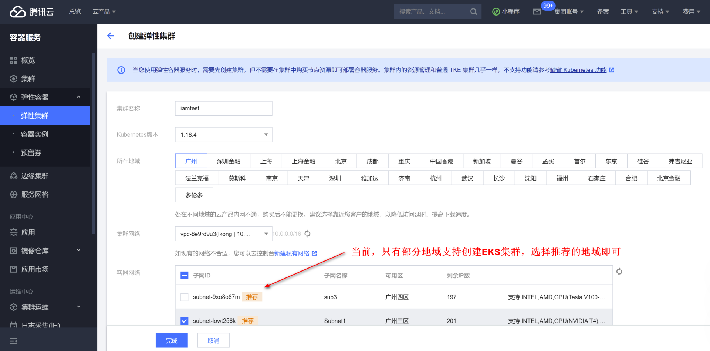
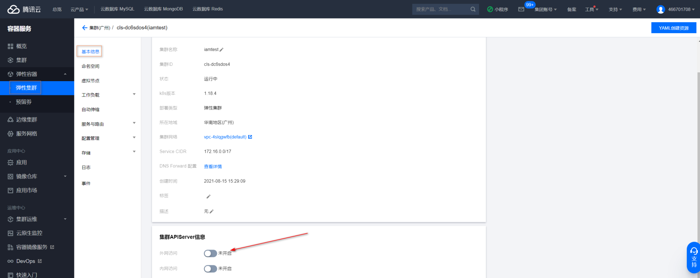
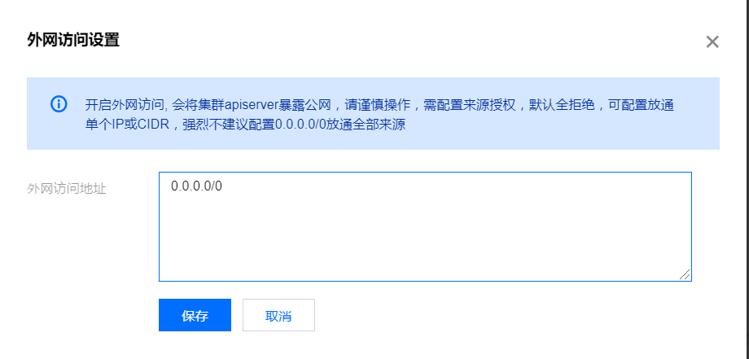
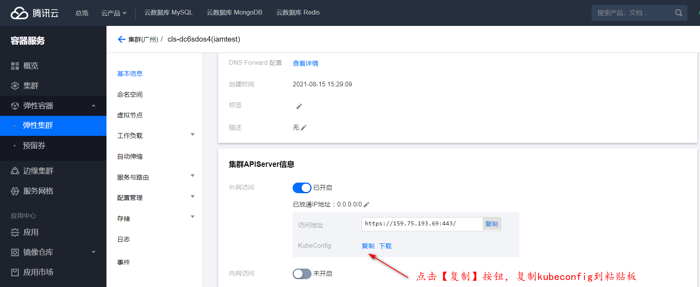

# 48 | 基于腾讯云 EKS 的容器化部署实战
你好，我是孔令飞。

在 [45讲](https://time.geekbang.org/column/article/415606) 中，我介绍了一种基于Kubernetes的云原生架构设计方案。在云原生架构中，我们是通过Docker + Kubernetes来部署云原生应用的。那么这一讲，我就手把手教你如何在Kubernetes集群中部署好IAM应用。因为步骤比较多，所以希望你能跟着我完成每一个操作步骤。相信在实操的过程中，你也会学到更多的知识。

## 准备工作

在部署IAM应用之前，我们需要做以下准备工作：

1. 开通腾讯云容器服务镜像仓库。
2. 安装并配置Docker。
3. 准备一个Kubernetes集群。

### 开通腾讯云容器服务镜像仓库

在Kubernetes集群中部署IAM应用，需要从镜像仓库下载指定的IAM镜像，所以首先需要有一个镜像仓库来托管IAM的镜像。我们可以选择将IAM镜像托管到 [DockerHub](https://hub.docker.com/) 上，这也是docker运行时默认获取镜像的地址。

但因为DockerHub服务部署在国外，国内访问速度很慢。所以，我建议将IAM镜像托管在国内的镜像仓库中。这里我们可以选择腾讯云提供的镜像仓库服务，访问地址为 [容器镜像服务个人版](https://console.cloud.tencent.com/tke2/registry)。

如果你已经有腾讯云的镜像仓库，可以忽略腾讯云镜像仓库开通步骤。

在开通腾讯云镜像仓库之前，你需要 [注册腾讯云账号](https://cloud.tencent.com/document/product/378/17985)，并完成 [实名认证](https://cloud.tencent.com/document/product/378/3629)。

开通腾讯云镜像仓库的具体步骤如下：

**第一步，开通个人版镜像仓库。**

1. 登录 [容器服务控制台](https://console.cloud.tencent.com/tke2)，选择左侧导航栏中的【镜像仓库】>【 [个人版](https://console.cloud.tencent.com/tke2/registry/user/self)】。

2. 根据以下提示，填写相关信息，并单击 **【开通】** 进行初始化。如下图所示：


- **用户名：** 默认是当前用户的账号ID，是你登录到腾讯云Docker镜像仓库的身份，可在 [账号信息](https://console.cloud.tencent.com/developer) 页面获取。
- **密码：** 是你登录到腾讯云 Docker 镜像仓库的凭证。

这里需要你记录用户名及密码，用于推送及拉取镜像。假如我们开通的镜像仓库，用户名为 `10000099xxxx`，密码为 `iam59!z$`。

这里要注意， `10000099xxxx` **要替换成你镜像仓库的用户名。**

**第二步，登录到腾讯云Registry** **（镜像仓库）。**

在我们开通完Registry，就可以登录Registry了。可以通过以下命令来登录腾讯云Registry：

```bash
$ docker login --username=[username] ccr.ccs.tencentyun.com

```

这里的username是腾讯云账号 ID，开通时已注册，可在 [账号信息](https://console.cloud.tencent.com/developer) 页面获取。docker命令会在后面安装。

**第三步，新建镜像仓库命名空间** **。**

如果想使用镜像仓库，那么你首先需要创建一个用来创建镜像的命名空间。上一步，我们开通了镜像仓库，就可以在“命名空间”页签新建命名空间了，如下图所示：


上图中，我们创建了一个叫 `marmotedu` 的命名空间。

这里，镜像仓库服务、命名空间、镜像仓库、标签这几个概念你可能弄不清楚。接下来，我详细介绍下四者的关系，关系如下图所示：


先来看下我们使用镜像仓库的格式： `<镜像仓库服务地址>/<命名空间>/<镜像仓库>:<标签>`，例如 `ccr.ccs.tencentyun.com/marmotedu/iam-apiserver-amd64:v1.1.0`。

如果想使用一个Docker镜像，我们首先需要开通一个镜像仓库服务（Registry），镜像仓库服务都会对外提供一个固定的地址供你访问。在Registry中，我们（User）可以创建一个或多个命名空间（Namespace），命名空间也可以简单理解为镜像仓库逻辑上的一个分组。

接下来，就可以在Namespace中创建一个或多个镜像仓库，例如 `iam-apiserver-amd64`、 `iam-authz-server-amd64`、 `iam-pump-amd64` 等。针对每一个镜像仓库，又可以创建多个标签（Tag），例如 `v1.0.1`、 `v1.0.2` 等。

`<镜像仓库>:<标签>` 又称为镜像。镜像又分为私有镜像和公有镜像，公有镜像可供所有能访问Registry的用户下载使用，私有镜像只提供给通过授权的用户使用。

### 安装Docker

开通完镜像仓库之后，我们还需要安装Docker，用来构建和测试Docker镜像。下面我来讲解下具体的安装步骤。

**第一步，安装Docker前置条件检查。**

需要确保CentOS系统启用了 `centos-extras` yum源，默认情况下已经启用，检查方式如下：

```bash
$ cat /etc/yum.repos.d/CentOS-Extras.repo
# Qcloud-Extras.repo

[extras]
name=Qcloud-$releasever - Extras
baseurl=http://mirrors.tencentyun.com/centos/$releasever/extras/$basearch/os/
gpgcheck=1
enabled=1
gpgkey=file:///etc/pki/rpm-gpg/RPM-GPG-KEY-Qcloud-8

```

如果 `/etc/yum.repos.d/CentOS-Extras.repo` 文件存在，且文件中 `extras` 部分的 `enabled` 配置项值为 `1`，说明已经启用了 `centos-extras` yum源。如果 `/etc/yum.repos.d/CentOS-Extras.repo` 文件不存在，或者 `enabled` 不为1，则需要创建 `/etc/yum.repos.d/CentOS-Extras.repo` 文件，并将上述内容复制进去。

**第二步，安装docker。**

Docker官方文档 [Install Docker Engine on CentOS](https://docs.docker.com/engine/install/centos/) 提供了3种安装方法:

- 通过Yum源安装。
- 通过RPM包安装
- 通过脚本安装。

这里，我们选择最简单的安装方式： **通过Yum源安装**。它具体又分为下面3个步骤。

1. 安装docker。

```bash
$ sudo yum install -y yum-utils # 1. 安装 `yum-utils` 包，该包提供了 `yum-config-manager` 工具
$ sudo yum-config-manager --add-repo https://download.docker.com/linux/centos/docker-ce.repo # 2. 安装 `docker-ce.repo` yum 源
$ sudo yum-config-manager --enable docker-ce-nightly docker-ce-test # 3. 启用 `nightly` 和 `test` yum 源
$ sudo yum install -y docker-ce docker-ce-cli containerd.io # 4. 安装最新版本的 docker 引擎和 containerd

```

1. 启动docker。

可以通过以下命令来启动 docker：

```bash
$ sudo systemctl start docker

```

docker的配置文件是 `/etc/docker/daemon.json` ，这个配置文件默认是没有的，需要我们手动创建：

```bash
$ sudo tee /etc/docker/daemon.json << EOF
{
  "bip": "172.16.0.1/24",
  "registry-mirrors": [],
  "graph": "/data/lib/docker"
}
EOF

```

这里，我来解释下常用的配置参数。

- registry-mirrors：仓库地址，可以根据需要修改为指定的地址。
- graph：镜像、容器的存储路径，默认是/var/lib/docker。如果你的 `/` 目录存储空间满足不了需求，需要设置graph为更大的目录。
- bip：指定容器的IP网段。

配置完成后，需要重启Docker：

```bash
$ sudo systemctl restart docker

```

1. 测试Docker是否安装成功。

```bash
$ sudo docker run hello-world
Unable to find image 'hello-world:latest' locally
latest: Pulling from library/hello-world
b8dfde127a29: Pull complete
Digest: sha256:0fe98d7debd9049c50b597ef1f85b7c1e8cc81f59c8d623fcb2250e8bec85b38
Status: Downloaded newer image for hello-world:latest
...
Hello from Docker!
This message shows that your installation appears to be working correctly.
....

```

`docker run hello-world` 命令会下载 `hello-world` 镜像，并启动容器，打印安装成功提示信息后退出。

这里注意，如果你通过Yum源安装失败，可以尝试Docker官方文档 [Install Docker Engine on CentOS](https://docs.docker.com/engine/install/centos/) 提供的其他方式安装。

**第三步，安装后配置。**

安装成功后，我们还需要做一些其他配置。主要有两个，一个是配置docker，使其可通过 `non-root` 用户使用，另一个是配置docker开机启动。

1. 使用 `non-root` 用户操作Docker

我们在Linux系统上操作，为了安全，需要以普通用户的身份登录系统并执行操作。所以，我们需要配置docker，使它可以被 `non-root` 用户使用。具体配置方法如下：

```bash
$ sudo groupadd docker # 1. 创建`docker`用户组
$ sudo usermod -aG docker $USER # 2. 将当前用户添加到`docker`用户组下
$ newgrp docker # 3. 重新加载组成员身份
$ docker run hello-world # 4. 确认能够以普通用户使用docker

```

如果在执行 `sudo groupadd docker` 时报 `groupadd: group 'docker' already exists` 错误，说明 `docker` 组已经存在了，可以忽略这个报错。

如果你在将用户添加到 docker 组之前，使用sudo运行过docker命令，你可能会看到以下错误：

```plain
WARNING: Error loading config file: /home/user/.docker/config.json -
stat /home/user/.docker/config.json: permission denied

```

这个错误，我们可以通过删除 `~/.docker/` 目录来解决，或者通过以下命令更改 `~/.docker/` 目录的所有者和权限：

```bash
$ sudo chown "$USER":"$USER" /home/"$USER"/.docker -R
$ sudo chmod g+rwx "$HOME/.docker" -R

```

1. 配置docker开机启动

大部分Linux发行版（RHEL、CentOS、Fedora、Debian、Ubuntu 16.04及更高版本）使用systemd来管理服务，包括指定开启时启动的服务。在Debian和Ubuntu上，Docker默认配置为开机启动。

在其他系统，我们需要手动配置Docker开机启动，配置方式如下（分别需要配置docker和containerd服务）：

要在引导时为其他发行版自动启动 Docker 和 Containerd，你可以使用以下命令：

```bash
$ sudo systemctl enable docker.service # 设置 docker 开机启动
$ sudo systemctl enable containerd.service # 设置 containerd 开机启动

```

如果要禁止 `docker`、 `containerd` 开启启动，可以用这个命令：

```bash
$ sudo systemctl disable docker.service # 禁止 docker 开机启动
$ sudo systemctl disable containerd.service # 禁止 containerd 开机启动

```

### 准备一个Kubernetes集群

安装完Docker之后，我们还需要一个Kubernetes集群，来调度docker容器。安装Kubernetes集群极其复杂，这里选择一种最简单的方式来准备一个Kubernetes集群：购买一个腾讯云弹性集群（EKS）。

如果你想自己搭建Kubernetes集群，这里建议你购买3台腾讯云CVM机器，并参照 [follow-me-install-kubernetes-cluster](https://github.com/opsnull/follow-me-install-kubernetes-cluster) 教程来一步步搭建Kubernetes集群，CVM机器建议的最小配置如下：


#### EKS简介

我先简单介绍一下EKS是什么。EKS（Elastic Kubernetes Service）即腾讯云弹性容器服务，是腾讯云容器服务推出的无须用户购买节点即可部署工作负载的服务模式。它完全兼容原生的 Kubernetes，支持使用原生方式创建及管理资源，按照容器真实的资源使用量计费。弹性容器服务 EKS 还扩展支持腾讯云的存储及网络等产品，同时确保用户容器的安全隔离，开箱即用。

#### EKS费用

那它是如何收费呢？EKS 是全托管的Serverless Kubernetes 服务，不会收取托管的 Master、etcd 等资源的费用。弹性集群内运行的工作负载采用后付费的按量计费模式，费用根据实际配置的资源量按使用时间计算。也就是说： **Kubernetes集群本身是免费的，只有运行工作负载，消耗节点资源时收费。**

EKS有3种计费模式：预留券、按量计费、竞价模式，这里我建议选择 **按量计费**。按量计费，支持按秒计费，按小时结算，随时购买随时释放，从专栏学习的角度来说，费用是最低的。EKS 会根据工作负载申请的 CPU、内存数值以及工作负载的运行时间来核算费用，具体定价，你可以参考： [定价\|弹性容器服务](https://buy.cloud.tencent.com/price/eks)。

这里我通过例子来说明一下费用问题，IAM应用会部署4个Deployment，每个Deployment一个副本：

- iam-apiserver：IAM REST API服务，提供用户、密钥、策略资源的CURD功能的API接口。
- iam-authz-server：IAM资源授权服务，对外提供资源授权接口。
- iam-pump：IAM数据清洗服务，从Redis中获取授权日志，处理后保存在MongoDB中。
- iamctl：IAM应用的测试服务，登陆iamctl Pod可以执行iamctl命令和smoke测试脚本，完成对IAM应用的运维和测试。

上述4个Deployment中的 **Pod配置均为0.25核、512Mi内存**。

这里，我们根据EKS的费用计算公式 `费用 = 相关计费项配置 × 资源单位时间价格 × 运行时间` 计算IAM部署一天的费用：

```
总费用 = (4 x 1) x (0.25 x 0.12 + 0.5 x 0.05) x 24 = 4.8 元

```

也就是按最低配置部署IAM应用，运行一天的费用是4.8元（一瓶水的钱，就能学到如何将IAM应用部署在Kubernetes平台上，很值！）。你可能想这个计算公式里每个数值都代表什么呢？我来解释一下，其中：

- (4 x 1)：Kubernetes Pod总个数（一共是4个Deployment，每个Pod 1个副本）。
- 0.25 x 0.12：连续运行1小时的CPU配置费用。
- 0.5 x 0.05：连续运行1小时的内存配置费用。
- 24：24小时，也即一天。

这里需要注意，为了帮助你节省费用，上述配置都是最低配置。在实际生产环境中，建议的配置如下：


因为iam-pump组件是有状态的，并且目前没有实现抢占机制，所以副本数需要设置为1。

另外，Intel按量计费的配置费用见下图：


在这里有个很重要的事情提醒你： **学完本节课，销毁这些Deployment，避免被继续扣费。建议腾讯云账户余额不要超过50元。**

#### 申请EKS集群

了解了EKS以及费用相关的问题，接下来我们看看如何申请EKS集群。你可以通过以下5步来申请EKS集群。在正式申请前，请先确保腾讯云账户有大于 **10 元** 的账户余额，否则在创建和使用EKS集群的过程中可能会因为费用不足而报错。

1. 创建腾讯云弹性集群

具体步骤如下：

首先，登录容器服务控制台，选择左侧导航栏中的【 [弹性集群](https://console.cloud.tencent.com/tke2/ecluster)】。

然后，在页面上方选择需创建弹性集群的地域，并单击【新建】。在“创建弹性集群”页面，根据以下提示设置集群信息。如下图所示：



页面中各选择项的意思，我来给你解释一下：

- **集群名称：** 创建的弹性集群名称，不超过60个字符。
- **Kubernetes版本：** 弹性集群支持1.12以上的多个 Kubernetes 版本选择，建议选择最新的版本。
- **所在地域：** 建议你根据所在地理位置选择靠近的地域，可降低访问延迟，提高下载速度。
- **集群网络：** 已创建的弹性集群 VPC 网络，你可以选择私有网络中的子网用于弹性集群的容器网络，详情请见 [私有网络（VPC）](https://cloud.tencent.com/document/product/215/20046) 。
- **容器网络：** 为集群内容器分配在容器网络地址范围内的 IP 地址。弹性集群的 Pod 会直接占用 VPC 子网 IP，请尽量选择 IP 数量充足且与其他产品使用无冲突的子网。
- **Service CIDR：** 集群的 ClusterIP Service 默认分配在所选 VPC 子网中，请尽量选择 IP 数量充足且与其他产品使用无冲突的子网。
- **集群描述：** 创建集群的相关信息，该信息将显示在“集群信息”页面。

设置完成后，单击【完成】即可开始创建，可在“弹性集群”列表页面查看集群的创建进度。

等待弹性集群创建完成，创建完成后的弹性集群页面如下图所示：


我们创建的弹性集群ID为 **cls-dc6sdos4**。

1. 开启外网访问

如果想访问EKS集群，需要先开启EKS的外网访问能力，开启方法如下：

登录容器服务控制台 -\> 选择左侧导航栏中的【 [弹性集群](https://console.cloud.tencent.com/tke2/ecluster)】 -\> 进入 **cls-dc6sdos4** 集群的详情页中 -> 选择【基本信息】 -\> 点击【外网访问】按钮。如下图所示：



这里要注意，开启外网访问时，为了安全，需要设置允许访问kube-apiserver的IP段。为了避免不必要的错误，外网访问地址我们设置为 `0.0.0.0/0` 。如下图所示：



注意，只有测试时才可这么设置为 `0.0.0.0/0` ，如果是生产环境，建议严格限制可以访问kube-apiserver的来源IP。

1. 安装kubectl命令行工具

如果要访问EKS（标准的Kubernetes集群），比较高效的方式是通过Kubernetes提供的命令行工具kubectl来访问。所以，还需要安装kubectl工具。

安装方式如下：

```bash
$ curl -LO "https://dl.k8s.io/release/$(curl -L -s https://dl.k8s.io/release/stable.txt)/bin/linux/amd64/kubectl"
$ mkdir -p $HOME/bin
$ mv kubectl $HOME/bin
$ chmod +x $HOME/bin/kubectl

```

具体可参考 [安装和设置 kubectl](https://kubernetes.io/docs/tasks/tools/install-kubectl/)。

你可以通过以下命令来配置kubectl的bash自动补全：

```bash
$ kubectl completion bash > $HOME/.kube-completion.bash
$ echo 'source $HOME/.kube-completion.bash' >> ~/.bashrc
$ bash

```

1. 下载并安装kubeconfig

安装完kubectl工具之后，需要配置kubectl所读取的配置文件。

这里注意，在上一步，我们开启了外网访问，开启后EKS会生成一个kubeconfig配置（ `kubeconfig` 即为kubectl的配置文件）。我们可以从页面下载并安装。

在弹性集群的基本信息页面，点击【复制】按钮，复制kubeconfig文件内容，如下图所示：



复制后，将粘贴板的内容保存在 `$HOME/.kube/config` 文件中。需要先执行 `mkdir -p $HOME/.kube` 创建 `.kube` 目录，再将粘贴版中的内容写到 `config` 文件中。

你可以通过以下命令，来测试kubectl工具是否成功安装和配置：

```bash
$ kubectl get nodes
NAME                    STATUS   ROLES    AGE    VERSION
eklet-subnet-lowt256k   Ready    <none>   2d1h   v2.5.21

```

如果输出了Kubernetes的eklet节点，并且节点状态为 **Ready**，说明Kubernetes集群运行正常，并且kubectl安装和配置正确。

1. EKS集群开通集群内服务访问外网能力

因为IAM应用中的数据库：MariaDB、Redis、MongoDB可能需要通过外网访问，所以还需要开通EKS中Pod访问外网的能力。

EKS支持通过配置 [NAT 网关](https://cloud.tencent.com/document/product/215/4975) 和 [路由表](https://cloud.tencent.com/document/product/215/4954) 来实现集群内服务访问外网。具体开启步骤，需要你查看腾讯云官方文档： [通过 NAT 网关访问外网](https://cloud.tencent.com/document/product/457/48710)。

在开通过程中有以下两点需要你注意：

- 在 **创建指向 NAT 网关的路由表** 步骤中，目的端要选择：0.0.0.0/0。
- 在 **关联子网至路由表** 步骤中，只关联创建EKS集群时选择的子网。

如果你的数据库需要通过外网访问，这里一定要确保EKS集群成功开通集群内服务访问外网能力，否则部署IAM应用时会因为访问不了数据库而失败。

## 安装IAM应用

上面，我们开通了镜像仓库、安装了Docker引擎、安装和配置了Kubernetes集群，那么接下来，我们就来看下如何将IAM应用部署到Kubernetes集群中。

假设IAM项目仓库根目录路径为 `$IAM_ROOT`，具体安装步骤如下：

1. 配置 `scripts/install/environment.sh`

`scripts/install/environment.sh` 文件中包含了各类自定义配置。你可能需要配置跟数据库相关的配置（当然，也可以都使用默认值）：

- MariaDB配置：environment.sh文件中以 `MARIADB_` 开头的变量。
- Redis配置：environment.sh文件中以 `REDIS_` 开头的变量。
- MongoDB配置：environment.sh文件中以 `MONGO_` 开头的变量。

其他配置，使用默认值。

1. 创建IAM应用的配置文件

```bash
$ cd ${IAM_ROOT}
$ make gen.defaultconfigs # 生成iam-apiserver、iam-authz-server、iam-pump、iamctl组件的默认配置文件
$ make gen.ca # 生成 CA 证书

```

上述命令会将IAM的配置文件存放在这个 `${IAM_ROOT}/_output/configs/` 目录下。

1. 创建IAM命名空间

我们将IAM应用涉及到的各类资源，都创建在 `iam` 命名空间中。将IAM资源创建在独立的命名空间中，不仅方便维护，还可以有效避免影响其他Kubernetes资源。

```bash
$ kubectl create namespace iam

```

1. 将IAM各服务的配置文件，以ConfigMap资源的形式保存在Kubernetes集群中

```bash
$ kubectl -n iam create configmap iam --from-file=${IAM_ROOT}/_output/configs/
$ kubectl -n iam get configmap iam
NAME   DATA   AGE
iam    4      13s

```

执行 `kubectl -n iam get configmap iam` 命令，可以成功获取创建的 `iam` configmap。

如果你觉得每次执行 `kubectl` 命令都要指定 `-n iam` 选项很繁琐，你可以使用以下命令，将 `kubectl` 上下文环境中的命名空间指定为 `iam`。设置后，执行 `kubectl` 命令，默认在 `iam` 命名空间下执行：

```bash
$ kubectl config set-context `kubectl config current-context` --namespace=iam

```

1. 将IAM各服务使用的证书文件，以ConfigMap资源的形式创建在Kubernetes集群中

```bash
$ kubectl -n iam create configmap iam-cert --from-file=${IAM_ROOT}/_output/cert
$ kubectl -n iam get configmap iam-cert
NAME       DATA   AGE
iam-cert   14     12s

```

执行 `kubectl -n iam get configmap iam-cert` 命令，可以成功获取创建的 `iam-cert` configmap。

1. 创建镜像仓库访问密钥

在准备阶段，我们开通了腾讯云镜像仓库服务（访问地址为ccr.ccs.tencentyun.com），并创建了用户 `10000099xxxx`，其密码为 `iam59!z$`。

接下来，我们就可以创建docker-registry secret。Kubernetes在下载Docker镜像时，需要docker-registry secret来进行认证。创建命令如下：

```bash
$ kubectl -n iam create secret docker-registry ccr-registry --docker-server=ccr.ccs.tencentyun.com --docker-username=10000099xxxx --docker-password='iam59!z$'

```

1. 创建Docker镜像，并Push到镜像仓库

将镜像Push到CCR镜像仓库，需要确保你已经登录到腾讯云CCR镜像仓库，如果没登录，可以执行以下命令来登录：

```bash
$ docker login --username=[username] ccr.ccs.tencentyun.com

```

执行 `make push` 命令构建镜像，并将镜像Push到CCR镜像仓库：

```bash
$ make push REGISTRY_PREFIX=ccr.ccs.tencentyun.com/marmotedu VERSION=v1.1.0

```

上述命令，会构建iam-apiserver-amd64、iam-authz-server-amd64、iam-pump-amd64、iamctl-amd64 四个镜像，并将这些镜像Push到腾讯云镜像仓库的 `marmotedu` 命名空间下。

构建的镜像如下：

```bash
$ docker images|grep marmotedu
ccr.ccs.tencentyun.com/marmotedu/iam-pump-amd64           v1.1.0   e078d340e3fb        10 seconds ago      244MB
ccr.ccs.tencentyun.com/marmotedu/iam-apiserver-amd64      v1.1.0   5e90b67cc949        2 minutes ago       239MB
ccr.ccs.tencentyun.com/marmotedu/iam-authz-server-amd64   v1.1.0   6796b02be68c        2 minutes ago       238MB
ccr.ccs.tencentyun.com/marmotedu/iamctl-amd64             v1.1.0   320a77d525e3        2 minutes ago       235MB

```

1. 修改 `${IAM_ROOT}/deployments/iam.yaml` 配置

这里请你注意，如果在上一个步骤中，你构建的镜像tag不是 `v1.1.0` ，那么你需要修改 `${IAM_ROOT}/deployments/iam.yaml` 文件，并将iam-apiserver-amd64、 iam-authz-server-amd64、 iam-pump-amd64、iamctl-amd64 镜像的tag修改成你构建镜像时指定的tag。

1. 部署IAM应用

```bash
$ kubectl -n iam apply -f ${IAM_ROOT}/deployments/iam.yaml

```

执行上述命令，会在 `iam` 命令空间下，创建一系列Kubernetes资源，可以使用以下命令，来获取这些资源的状态：

```bash
$ kubectl -n iam get all
NAME                                    READY   STATUS    RESTARTS   AGE
pod/iam-apiserver-d8dc48596-wkhpl       1/1     Running   0          94m
pod/iam-authz-server-6bc899c747-fbpbk   1/1     Running   0          94m
pod/iam-pump-7dcbfd4f59-2w9vk           1/1     Running   0          94m
pod/iamctl-6fc46b8ccb-gs62l             1/1     Running   1          98m

NAME                       TYPE        CLUSTER-IP      EXTERNAL-IP   PORT(S)                      AGE
service/iam-apiserver      ClusterIP   192.168.0.174   <none>        8443/TCP,8080/TCP,8081/TCP   101m
service/iam-authz-server   ClusterIP   192.168.0.76    <none>        9443/TCP,9090/TCP            101m
service/iam-pump           ClusterIP   192.168.0.155   <none>        7070/TCP                     101m

NAME                               READY   UP-TO-DATE   AVAILABLE   AGE
deployment.apps/iam-apiserver      1/1     1            1           101m
deployment.apps/iam-authz-server   1/1     1            1           101m
deployment.apps/iam-pump           1/1     1            1           101m
deployment.apps/iamctl             1/1     1            1           101m

NAME                                          DESIRED   CURRENT   READY   AGE
replicaset.apps/iam-apiserver-d8dc48596       1         1         1       101m
replicaset.apps/iam-authz-server-6bc899c747   1         1         1       101m
replicaset.apps/iam-pump-7dcbfd4f59           1         1         1       101m
replicaset.apps/iamctl-6fc46b8ccb             1         1         1       101m

```

我们看到 `pod/iam-apiserver-d8dc48596-wkhpl`、 `pod/iam-authz-server-6bc899c747-fbpbk`、 `pod/iam-pump-7dcbfd4f59-2w9vk`、 `pod/iamctl-6fc46b8ccb-gs62l` 4个Pod都处在 `Running` 状态，说明服务都成功启动。

## 测试IAM应用

我们在 `iam` 命令空间下创建了一个测试Deployment `iamctl`。你可以登陆 `iamctl` Deployment所创建出来的Pod，执行一些运维操作和冒烟测试。登陆命令如下：

```bash
$ kubectl -n iam exec -it `kubectl -n iam get pods -l app=iamctl | awk '/iamctl/{print $1}'` -- bash

```

登陆到 `iamctl-xxxxxxxxxx-xxxxx` Pod中后，就可以执行运维操作和冒烟测试了。

1. 运维操作

在iamctl容器中，你可以使用iamctl工具提供的各类功能，iamctl以子命令的方式对外提供功能。命令执行效果见下图：


1. 冒烟测试

```bash
# cd /opt/iam/scripts/install
# ./test.sh iam::test::smoke

```

如果 `./test.sh iam::test::smoke` 命令，打印的输出中，最后一行为 `congratulations, smoke test passed!` 字符串，说明IAM应用安装成功。如下图所示：


## 销毁EKS集群及其资源

好了，到这里，你已经成功在EKS集群中部署了IAM应用，EKS的使命也就完成了。接下来，为避免账户被持续扣费，需要删除EKS内的资源和集群。

1. 删除EKS内创建的IAM资源

```bash
$ kubectl delete namespace iam

```

因为删除Namespace会删除Namespace下的所有资源，所以上述命令执行时间会久点。

1. 删除EKS集群

首先，登录容器服务控制台，选择左侧导航栏中的【 [弹性集群](https://console.cloud.tencent.com/tke2/ecluster)】。

然后，选择创建的EKS集群：cls-dc6sdos4，点击最右侧的【删除】按钮，删除EKS集群。如下图所示：


## 总结

云原生架构设计中，需要将IAM应用部署到Kubernetes集群中。所以，首先需要你准备一个Kubernetes集群。你可以自己购买腾讯云CVM机器搭建Kubernetes集群，但这种方式费用高、操作复杂。所以，我建议你直接申请一个EKS集群来部署IAM应用。

EKS集群是一个标准的Kubernetes集群，可以快速申请，并免运维。EKS集群只收取实际的资源使用费用。在专栏学习过程中，部署IAM应用期间产生的资源使用费用其实是很低的，所以推荐使用这种方式来部署IAM应用。

有了Kubernetes集群，就可以直接通过以下命令来部署整个IAM应用：

```bash
$ kubectl -n iam apply -f ${IAM_ROOT}/deployments/iam.yaml

```

应用部署起来之后，我们可以登陆到 `iamctl-xxxxxxxxxx-xxxxx` Pod，并执行以下命令来测试整个IAM应用是否被成功部署：

```bash
# cd /opt/iam/scripts/install
# ./test.sh iam::test::smoke

```

## 课后练习

1. 思考下，如何将MariaDB、MongoDB、Redis实现容器化？
2. 思考下，如何更相信IAM应用中的iam-apiserver服务，试着更新这个服务。

欢迎你在留言区与我交流讨论，我们下一讲见。