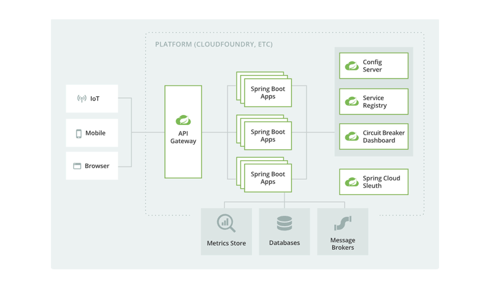
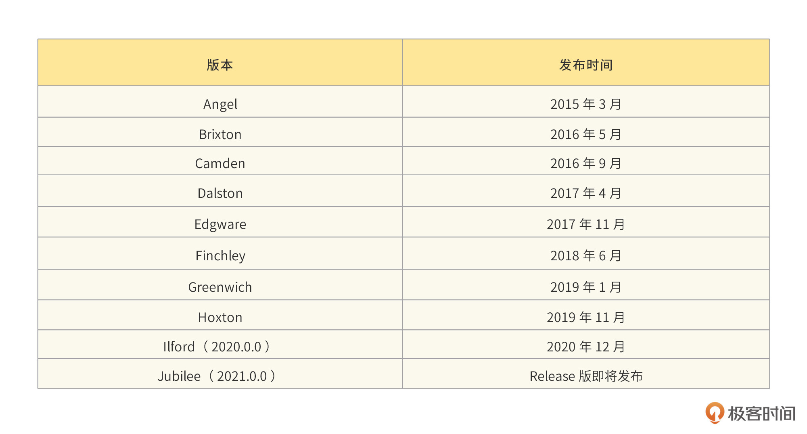

# 02 | 微服务全家桶：走进 Spring Cloud 的世界
你好，我是姚秋辰。

上一节课，我向你介绍了微服务架构的特点和优势。今天我就来带你了解 Spring Cloud 框架，看一看被称为微服务全家桶的 Spring Cloud 提供了哪些强大的工具。

通过今天的学习，你将会了解 Spring Cloud 框架的功能定位，以及它和 Spring Boot 之间的关系。除此之外，我还会详细讲解 Spring Cloud 的发展历史，并介绍 Netflix 和 Alibaba 两大核心组件库，以及 Spring Cloud 的版本更新策略。这样一来，你就对 Spring Cloud 框架有了一个全面的认识。

那我首先来带你了解一下什么是 Spring Cloud。

## 大话Spring Cloud

Spring Cloud可谓出身名门，它由Spring开源社区主导孵化的，专门为了解决微服务架构难题而诞生的一款微“微服务全家桶”框架。难能可贵的是，Spring Cloud走了一条博采众家之长的道路，除了Spring开源社区的研发力量以外，它还吸纳了很多业界一线互联网大厂的开源组件为己用，将这些经过大厂真实业务锤炼的组件孵化成为了Spring Cloud组件的一部分。

我们通过Spring社区发布的一张简化的架构图来看一下Spring Cloud的技能加点。

在上面这幅图中，我们可以看到有几个Spring Boot Apps的应用集群，这就是经过拆分后的微服务。Spring Cloud和Spring Boot达成了一种默契的配合：Spring Boot主内，通过自动装配和各种开箱即用的特性，搞定了数据层访问、RESTful接口、日志组件、内置容器等等基础功能，让开发人员不费吹灰之力就可以搭建起一个应用；Spring Cloud主外，在应用集群之外提供了各种分布式系统的支持特性，帮助你轻松实现负载均衡、熔断降级、配置管理等诸多微服务领域的功能。

从Spring Boot和Spring Cloud的分工中我们可以看出，Spring Boot忙活的是底层的柴米油盐酱醋茶，Spring Boot后勤保障做得好，才能让Spring Cloud毫无顾虑地投身于微服务的星辰大海，两者合二为一完整构建了微服务领域的全家桶解决方案。

到这里，相信你已经可以理解Spring Boot和Spring Cloud的侧重点，以及Spring Cloud的功能定位。那么接下来，让我带你去了解一下Spring Cloud内部都有哪些重要组件。

## Spring Cloud组件库的朝代更替

在我们开始了解Spring Cloud组件库之前，我得先介绍在Spring Cloud历史上举足轻重的两家公司Netflix和Alibaba，以及它们的恩怨情仇。这两家公司分别为开源社区贡献了Spring Cloud Netflix组件库和Spring Cloud Alibaba组件库。

说起Netflix可能你并不知道，但提起《纸牌屋》你一定看过或者听过，这部高分美剧就是由这家我们俗称“奈飞”的公司出品的。Netflix是一家美国的流媒体巨头，它靠着自己强大的技术实力，开发沉淀了一系列优秀的组件，这些组件经历了Netflix线上庞大业务规模的考验，功能特性和稳定性过硬。如Eureka服务注册中心、Ribbon负载均衡器、Hystrix服务容错组件等。后来发生的故事可能你已经猜到了，Netflix将这些组件贡献给了Spring开源社区，构成了Netflix组件库。可以这么说，在Spring Cloud的早期阶段，是Netflix打下了的半壁江山。

Netflix和Spring Cloud度过了蜜月期之后，矛盾就逐渐发生了。先是Eureka 2.0开源计划的搁浅，而后Netflix宣布Hystrix进入维护状态，Eureka和Hystrix这两款Netflix组件库的明星项目停止了新功能的研发，Spring社区不得不开始思考替代方案，在后续的新版本中走向了“去Netflix化”。以至于Netflix的网关组件Zuul 2.0历经几次跳票千呼万唤始出来后，Spring Cloud社区已经不打算集成Zuul 2.0，而是掏出了自己的Gateway网关。在最新版本的Spring Cloud中，Netflix的踪迹已经逐渐消散，只有Eureka组件形单影只待在Netflix组件库中，回忆着昔日的辉煌。

Spring Cloud Alibaba是由Alibaba贡献的组件库，随着阿里在开源路线上的持续投入，近几年阿里系在开源领域的声音非常响亮。 **Spring Cloud Alibaba凝聚了阿里系在电商领域超高并发经验的重量级组件，保持了旺盛的更新活力，成为了Spring Cloud社区的一股新生代力量，逐渐取代了旧王Netflix的江湖地位**。Spring Cloud Alibaba组件秉承了“大而全”的特点，就像一个大中台应用一般包罗万象，在功能特性的丰富程度上做到了应有尽有，待我们学到Spring Cloud章节后你就能体会到了。这也是本课程选择Spring Cloud Alibaba组件的一个重要原因。

## Spring Cloud全家桶组件库

我整理归纳了一个表格，将Spring Cloud中的核心组件库根据功能点做了分类，让你对每个特性功能的可选组件一目了然， **其中红色加粗的，是我们在课程实战环节将要集成的组件**，你可以参考一下。

上面表格中列出的是业务开发过程中的常用功能性组件，除了这些以外，Spring Cloud官方还提供了很多可扩展组件，比如用来支持构建集群的Spring Cloud Cluster、提供安全特性支持的Spring Cloud Security、云原生的流处理数据管道Spring Cloud Data Flow等等，你可以在这个 [Spring Cloud官方文档](https://spring.io/projects/spring-cloud) 中找到完整的列表。

如果你想了解Spring Cloud Alibaba组件的更多细节，我推荐你阅读spring-cloud-alibaba的 [官方GitHub首页](https://github.com/alibaba/spring-cloud-alibaba) 或者 [开源社区文档](https://spring.io/projects/spring-cloud-alibaba)。

到这里，我们对Spring Cloud的核心组件库有了一个比较全面的了解，接下来，我带你去了解一下Spring Cloud的版本更新策略。

## Spring Cloud版本更新策略

大部分开源项目以数字版本进行更新迭代，Spring Cloud在诞生之初就别出心裁使用了字母序列，以字母A开头，按顺序使用字母表中的字母标识重大迭代发布的大版本号。

我整理了一个表格，包含了Spring Cloud编年史各个版本的代号以及Release版的发布时间，我们来感受一下Spring Cloud的更新节奏：

从上面的表格中我们可以看出， **Spring Cloud自2015年发布之始就保持了极其旺盛的生命力**， **早期版本每半年就有一个大的版本号迭代**，即便发展至今，也保持着几乎一年一升版的快速更新节奏。正是由于开源社区的持续输出，以及像Alibaba这类大型公司的助力，才有了今天微服务领域最为完善的Spring Cloud全家桶组件库。

我们看完了Spring Cloud的大版本迭代更新策略，在大版本发布之前，还要经历很多小版本的迭代，接下来我带你了解一下Spring Cloud的小版本更新策略。如果你不清楚这里面的门道，很容易就会误用非稳定版本。

- **SNAPSHOT版本**：正在开发中的快照版本，例如2021.0.0-SNAPSHOT，快照版代表当前分支最新的代码进度，也是更新最为频繁的小版本类型，不推荐在线上正式环境使用；
- **Milestone版本**：在大版本正式发布前的里程碑版本，例如2021.0.0-M1，M1代表当前大版本的第一个里程碑版本，M2代表第二个迭代里程碑，以此类推。在正式版本发布之前要经历多个里程碑的迭代，像Spring Cloud Finchley版足足经历了9个M版本之后，才过渡到了RC版。同样地，我也不推荐你在正式项目中使用Milestone版本；
- **Release Candidate版本**：这就是我们俗称的RC版，例如2021.0.0-RC1。当一个版本迭代到RC版的时候，意味着离正式发布已经不远了。但是你要注意，RC版是发布前的候选版本，走到这一步通常已经没有新的功能开发，RC主要目的是开放出来让大家试用并尽量修复严重Bug。
- **Release版**：稳定的正式发布版，比如2020.0.1。你可以在自己的线上业务中放心使用Release稳定版。

到这里，我们就完整了解了Spring Cloud的发展历史、核心组件库、版本更新策略。现在，我们来回顾一下这节课的重点内容。

## 总结

今天我带你了解了Spring Cloud框架的定位和它的核心组件库。以史为镜，我们了解了Netflix组件库和Alibaba组件库朝代更替的背景故事，以帮助我们在做技术选型的时候尽可能避开已经进入“维护状态”的组件。

此外，我想再和你分享一些新旧工具应用的经验。我周围很多的技术人员在做项目的时候容易进入一个误区，那就是“为新而新”，什么意思呢？每当一个新版本出来的时候，他们就迫不及待地把自己的业务升级到最新版本，盲目追新，殊不知这样做很容易翻车。作为一名老司机，我推荐你这样做： **当你心仪的框架有重大版本更新时，我还是建议你先按兵不动，等大版本做了一两次迭代之后，明显的Bug修复得七七八八了，再应用到自己的项目中也不迟**。

## 思考题

当你考虑给自己的项目做底层技术框架升版的时候，你会基于哪些因素做出“升级版本”的决定呢？欢迎你与我交流讨论，我在留言区等你。

好啦，这节课就结束啦。也欢迎你把这节课分享给更多对Spring Cloud感兴趣的朋友。我是姚秋辰，我们下节课再见！