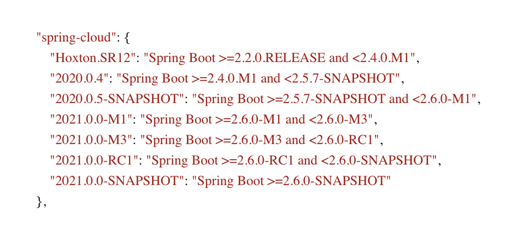
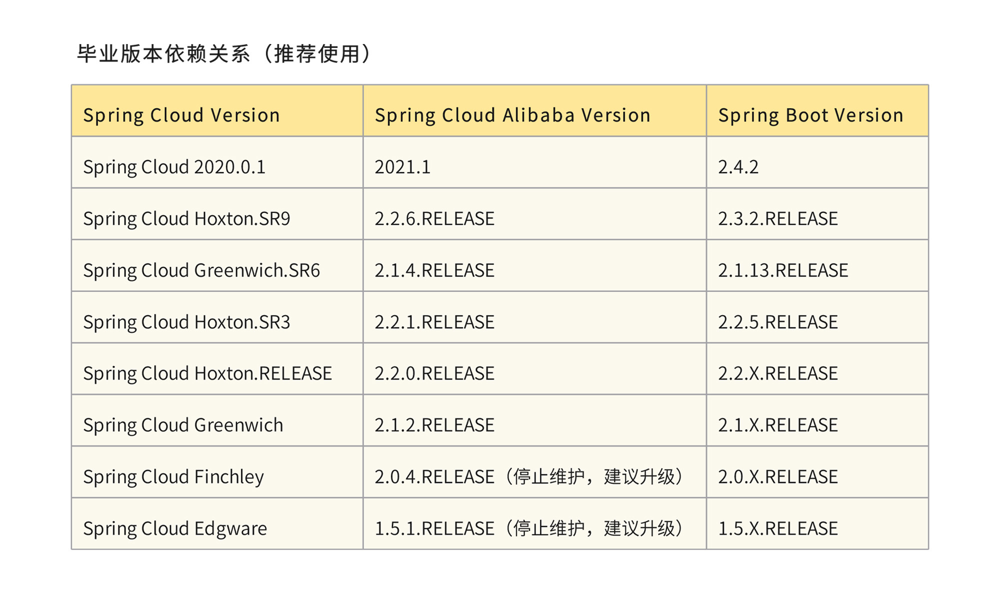
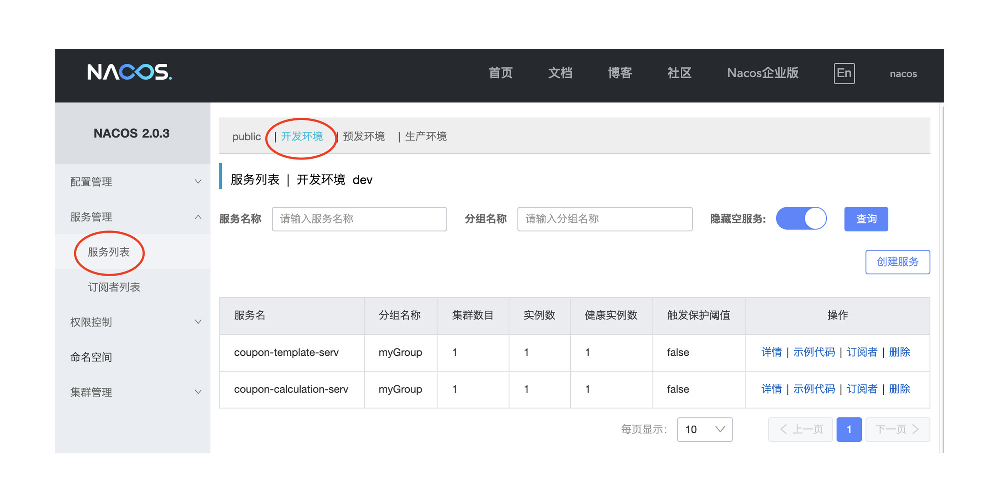

# 09 | 集成 Nacos：如何将服务提供者注册到 Nacos 服务器？
你好，我是姚秋辰。

今天我们来动手集成优惠券平台项目到Nacos服务器。这个项目我们将分两节课来讲，通过这两节课的学习，你可以知道如何借助Nacos，搭建起一个端到端的微服务调用链路。在这个过程中，你还会学到Nacos自动装配器的工作原理，以及Nacos核心参数的配置。掌握了这些内容，你就可以平稳驾驭Nacos服务治理了。

在Nacos的地盘上，下游服务需要先将自己作为“服务提供者”注册到Nacos，这个流程叫做“服务注册”；而上游服务作为“服务消费者”，需要到Nacos中获取可供调用的下游服务的列表，这个流程就是“服务发现”。

今天我先从两个下游服务coupon-template-serv和coupon-calculation-serv开始，利用Nacos的服务注册功能，将服务提供者注册到Nacos服务器。在下一节课中，我再向你展示作为服务消费者的coupon-customer-serv是如何通过服务发现机制向服务提供者发起调用。

在集成Nacos之前，我们需要先把Nacos的依赖项引入到项目中。

## 添加Nacos依赖项

Nacos是Sping Cloud Alibaba项目的一款组件，在引入Nacos的依赖项之前，我们需要在项目的顶层pom中定义所要使用的Spring Cloud和Spring Cloud Alibaba的版本。

Spring Boot、Spring Cloud和Spring Cloud Alibaba三者之间有严格的版本匹配关系，这三个组件的口味非常刁钻，只能和特定版本区间的搭档相互合作，一旦用错了版本，就会产生各种莫名其妙的兼容性问题。那么我们在哪里可以查询到正确的版本匹配关系呢？

Spring Boot和Spring Cloud的版本匹配关系可以从 [Spring社区网站](https://start.spring.io/actuator/info) 获取，访问该网址后你会看到一串JSON文件，在这个文件中，你可以看到Spring 官方给出的Spring Cloud最新分支所支持的Spring Boot版本范围。



另外，Spring Cloud Alibaba、Spring Boot和Spring Cloud的匹配关系可以从Spring Cloud Alibaba的官方 [GitHub wiki页](https://github.com/alibaba/spring-cloud-alibaba/wiki/%E7%89%88%E6%9C%AC%E8%AF%B4%E6%98%8E) 中获取，我将一些常用的版本绘制成表格，你可以作为参考。



我推荐你使用上图中指定的版本组合，这里列出的组合都是经过兼容性测试的稳定版本，可以用在生产环境中。我这里选择Spring Cloud 2020.0.1、Spring Cloud Alibaba 2021.1和Spring Boot 2.4.2作为实战项目的依赖版本。

接下来，我们将Spring Cloud Alibaba和Spring Cloud的依赖项版本添加到顶层项目geekbang-coupon下的pom.xml文件中。

```
<dependencyManagement>
    <dependencies>
        <dependency>
            <groupId>org.springframework.cloud</groupId>
            <artifactId>spring-cloud-dependencies</artifactId>
            <version>2020.0.1</version>
            <type>pom</type>
            <scope>import</scope>
        </dependency>

        <dependency>
            <groupId>com.alibaba.cloud</groupId>
            <artifactId>spring-cloud-alibaba-dependencies</artifactId>
            <version>2021.1</version>
            <type>pom</type>
            <scope>import</scope>
        </dependency>
   </dependencies>
   <!-- 省略部分代码 -->
</dependencyManagement>

```

定义了组件的大版本之后，我们就可以直接把Nacos的依赖项加入到coupon-template-serv和coupon-calculation-serv了。我分别在这两个子模块的pom.xml文件中加入了Nacos的依赖项spring-cloud-starter-alibaba-nacos-discovery。

```
<dependency>
    <groupId>com.alibaba.cloud</groupId>
    <artifactId>spring-cloud-starter-alibaba-nacos-discovery</artifactId>
</dependency>

```

由于我已经将Spring Cloud Alibaba的依赖项版本加到了顶层项目geekbang-coupon，因此，在添加Nacos依赖项到子模块的时候不需要特别指定 < version > 内容，当前子模块会尝试从父级项目读取正确的版本信息。

在添加完依赖项之后，我们就可以通过配置项开启Nacos的服务治理功能了。Nacos通过自动装配流程（auto configuration）加载配置项并开启服务注册。这个功能可不是Nacos所独有的，Spring Cloud各个组件都采用了自动装配器实现了轻量级的组件集成功能，你只需要几行配置，剩下的初始化工作都可以交给背后的自动装配器来实现。

不过，接下来我要带你了解一下Nacos自动装配器的底层原理，因为这将有助于你理解Spring Cloud组件的启动流程，如果你将来需要开发一个自定义的组件，就可以借鉴这种设计模式。

## Nacos自动装配原理

在Spring Cloud稍早一些的版本中，我们需要在启动类上添加@EnableDiscoveryClient注解开启服务治理功能，而在新版本的Spring Cloud中，这个注解不再是一个必须的步骤，我们只需要通过配置项就可以开启Nacos的功能。那么Nacos是怎么在启动阶段自动加载配置项并开启相关功能的呢？这就要从Spring Framework的自动装配流程（Auto Configuration）说起了。

我们将Nacos依赖项添加到项目中，同时也引入了Nacos自带的自动装配器，比如下面这几个被引入的自动装配器就掌管了Nacos核心功能的初始化任务。

- **NacosDiscoveryAutoConfiguration**：服务发现功能的自动装配器，它主要做两件事儿：加载Nacos配置项，声明NacosServiceDiscovery类用作服务发现；
- **NacosServiceAutoConfiguration**：声明核心服务治理类NacosServiceManager，它可以通过service id、group等一系列参数获取已注册的服务列表；
- **NacosServiceRegistryAutoConfiguration**：Nacos服务注册的自动装配器。

我们以 **NacosDiscoveryAutoConfiguration** 类为例，了解一下它是怎么样工作的，先来看一下它的源码。

```
@Configuration(proxyBeanMethods = false)
// 当spring.cloud.discovery.enabled=true时才生效
@ConditionalOnDiscoveryEnabled
// 当spring.cloud.nacos.discovery.enabled=true时生效
@ConditionalOnNacosDiscoveryEnabled
public class NacosDiscoveryAutoConfiguration {

   // 读取Nacos所有配置项并封装到NacosDiscoveryProperties中
   @Bean
   @ConditionalOnMissingBean
   public NacosDiscoveryProperties nacosProperties() {
      return new NacosDiscoveryProperties();
   }

   // 声明服务发现的功能类NacosServiceDiscovery
   @Bean
   @ConditionalOnMissingBean
   public NacosServiceDiscovery nacosServiceDiscovery(
         NacosDiscoveryProperties discoveryProperties,
         NacosServiceManager nacosServiceManager) {
      return new NacosServiceDiscovery(discoveryProperties, nacosServiceManager);
   }
}

```

NacosDiscoveryAutoConfiguration自动装配器有两个开启条件，分别是spring.cloud.discovery.enabled=true和spring.cloud.nacos.discovery.enabled=true。当我们引入Nacos的依赖项后，默认情况下这两个开关参数的值就已经是True了。也就是说，除非你主动关闭Spring Cloud和Nacos的服务发现开关，否则这个自动装配器就会自动执行加载。

接下来，我们来了解一下NacosDiscoveryAutoConfiguration中声明的两个方法，也就是nacosProperties方法和nacosServiceDiscovery方法都有什么功能。

在上面的源码中，我们看到，nacosProperties方法返回了一个NacosDiscoveryProperties类，这个类是专门用来读取和封装Nacos配置项的类，它的源码如下：

```
// 定义了配置项读取的路径
@ConfigurationProperties("spring.cloud.nacos.discovery")
public class NacosDiscoveryProperties {
 // 省略类属性
 // 这里定义的类属性和接下来我们要介绍的配置项是一一对应的
}

```

NacosDiscoveryProperties类通过ConfigurationProperties注解从spring.cloud.nacos.discovery路径下获取配置项，Spring框架会自动将这些配置项解析到NacosDiscoveryProperties类定义的类属性中。这样一来Nacos就完成了配置项的加载，在其它业务流程中，只需要注入NacosDiscoveryProperties类就可以读取Nacos的配置参数。

NacosDiscoveryAutoConfiguration中的另一个方法nacosServiceDiscovery声明了一个服务发现的功能类NacosServiceDiscovery，它的核心方法的源码如下：

```
public class NacosServiceDiscovery {
   // 封装了Nacos配置项的类
   private NacosDiscoveryProperties discoveryProperties;
   // 另一个自动装配器声明的核心服务治理类
   private NacosServiceManager nacosServiceManager;

   // 根据服务名称获取所有已注册服务
   public List<ServiceInstance> getInstances(String serviceId) throws NacosException {
      String group = discoveryProperties.getGroup();
      List<Instance> instances = namingService().selectInstances(serviceId, group,
            true);
      return hostToServiceInstanceList(instances, serviceId);
   }

   // 返回所有服务的服务名称
   public List<String> getServices() throws NacosException {
      String group = discoveryProperties.getGroup();
      ListView<String> services = namingService().getServicesOfServer(1,
            Integer.MAX_VALUE, group);
      return services.getData();
   }
   // 省略部分代码...
}

```

通过NacosServiceDiscovery暴露的方法，我们就能够根据serviceId（注册到nacos的服务名称）查询到可用的服务实例，获取到服务实例列表之后，调用方就可以发起远程服务调用了。

好，到这里我们就了解了NacosDiscoveryAutoConfiguration装配器做了什么事儿，希望你可以举一反三，通过阅读Nacos源码，深入了解下另外两个自动装配器NacosServiceAutoConfiguration和NacosServiceRegistryAutoConfiguration的底层业务。

了解了Nacos如何通过自动装配器加载配置项并开启服务治理功能之后，我们接下来去项目中添加Nacos的配置项。

## 添加Nacos配置项

Nacos的配置项包含了服务注册参数与各项运行期参数，你可以使用标准的Spring Boot配置管理的方式设置Nacos的运行参数。

以我们今天要改造的服务coupon-template-impl为例，我们先来看一下application.yml文件中添加了哪些Nacos核心配置。Nacos相关的配置项位于spring.cloud.nacos路径下，我配置的Nacos常用参数如下：

```
spring:
  cloud:
    nacos:
      discovery:
        # Nacos的服务注册地址，可以配置多个，逗号分隔
        server-addr: localhost:8848
        # 服务注册到Nacos上的名称，一般不用配置
        service: coupon-customer-serv
        # nacos客户端向服务端发送心跳的时间间隔，时间单位其实是ms
        heart-beat-interval: 5000
        # 服务端没有接受到客户端心跳请求就将其设为不健康的时间间隔，默认为15s
        # 注：推荐值该值为15s即可，如果有的业务线希望服务下线或者出故障时希望尽快被发现，可以适当减少该值
        heart-beat-timeout: 20000
        # 元数据部分 - 可以自己随便定制
        metadata:
          mydata: abc
        # 客户端在启动时是否读取本地配置项(一个文件)来获取服务列表
        # 注：推荐该值为false，若改成true。则客户端会在本地的一个
        # 文件中保存服务信息，当下次宕机启动时，会优先读取本地的配置对外提供服务。
        naming-load-cache-at-start: false
        # 命名空间ID，Nacos通过不同的命名空间来区分不同的环境，进行数据隔离，
        namespace: dev
        # 创建不同的集群
        cluster-name: Cluster-A
        # [注意]两个服务如果存在上下游调用关系，必须配置相同的group才能发起访问
        group: myGroup
        # 向注册中心注册服务，默认为true
        # 如果只消费服务，不作为服务提供方，倒是可以设置成false，减少开销
        register-enabled: true

```

我带你深入了解下上面的每个参数，以及它们背后的一些使用场景，掌握了这些Nacos的核心配置项，你就可以平稳驾驭Nacos服务治理了。


在这些参数中，Namespace和Group经常搭配在一块来使用，它俩在功能上也有相似之处，在实际应用中经常傻傻分不清楚它俩的用途。为了帮你更好地理解这两个参数，我来带你深入了解下这两个属性各自的使用场景。

Namespace可以用作环境隔离或者多租户隔离，其中：

- **环境隔离**：比如设置三个命名空间production、pre-production和dev，分别表示生产环境、预发环境和开发环境，如果一个微服务注册到了dev环境，那么他无法调用其他环境的服务，因为服务发现机制只会获取到同样注册到dev环境的服务列表。如果未指定namespace则服务会被注册到public这个默认namespace下。
- **多租户隔离**：即multi-tenant架构，通过为每一个用户提供独立的namespace以实现租户与租户之间的环境隔离。

Group的使用场景非常灵活，我来列举几个：

- **环境隔离**：在多租户架构之下，由于namespace已经被用于租户隔离，为了实现同一个租户下的环境隔离，你可以使用group作为环境隔离变量。
- **线上测试**：对于涉及到上下游多服务联动的场景，我将线上已部署的待上下游测服务的group设置为“group-A”，由于这是一个新的独立分组，所以线上的用户流量不会导向到这个group。这样一来，开发人员就可以在不影响线上业务的前提下，通过发送测试请求到“group-A”的机器完成线上测试。
- **单元封闭**：什么是单元封闭呢？为了保证业务的高可用性，通常我们会把同一个服务部署在不同的物理单元（比如张北机房、杭州机房、上海机房），当某个中心机房出现故障的时候，我们可以在很短的时间内把用户流量切入其他单元机房。由于同一个单元内的服务器资源通常部署在同一个物理机房，因此本单元内的服务调用速度最快，而跨单元的服务调用将要承担巨大的网络等待时间。这种情况下，我们可以为同一个单元的服务设置相同的group，使微服务调用封闭在当前单元内，提高业务响应速度。

除了这几个场景外，你能举一反三想一下还有其他场景吗？如果你想更进一步了解Nacos的配置参数全集，可以查看 [Nacos的官方GitHub](https://github.com/alibaba/spring-cloud-alibaba) 或者 [Nacos项目首页](https://nacos.io)。

接下来，我们只需要启动Nacos注册中心，尝试将改造好的coupon-template-serv和coupon-calculation-serv注册到Nacos服务器，验证Nacos的服务注册功能。

## 验证Nacos服务注册功能

首先，我们需要开启Nacos服务器，你可以参考 [第8节课](https://time.geekbang.org/column/article/473165) 的内容，以单机模式或者集群模式开启Nacos服务器。

接下来，我们需要在Nacos上创建若干个namespace（命名空间），你需在下图右侧导航栏找到“命名空间”页面，进入该页面点击“新增命名空间”按钮，分别创建三个不同的环境：production、pre-production和dev，用来表示生产环境、预发环境和开发环境。在创建namespace的过程中，一定要保证命名空间的ID和项目中的namespace属性是一致的。


创建好命名空间之后，我们就可以在本地尝试启动coupon-template-impl和coupon-calculation-impl两个服务的Main方法。在这个过程中，你需要注意控制台打印出来的日志是否包含错误信息，如果有异常抛出则要case by case仔细分析。

如果应用启动一切正常，那么你就可以在下图的Nacos的服务列表中找到这两个服务。记得要选中你在应用中配置的namespace（下图上方红框处标记的“开发环境”）才能看到对应的服务注册情况。



好，到这里，我们的服务注册就已经完成了。

如果你是第一次接触Nacos注册中心，可能会不小心踩到一些小坑。比如说“我的服务为什么注册不上”就是一个常见的问题，这时候有几个排查问题的方向：

1. 你可以先查看下你的应用启动日志，看启动过程中是否有向Nacos服务器发起注册请求，如果没有相关日志，那极大可能是你的服务注册功能被手动关闭了，或者没有引入Nacos的依赖项以启动自动装配功能；
2. 如果日志中抛出了异常，那么要case-by-case去检查异常发生的原因，是Nacos服务器地址不正确，还是参数设置不正确导致的；
3. 当日志一切正常，可服务列表还看不到数据，那么你就要看一下是不是你开启了多个Nacos服务器，而服务器之间没有通过集群模式启动注册表同步；
4. 另外你还要特别注意下配置参数中是否指定了Namespace，如果是的话，那么服务只会出现在服务列表页面中对应的Namespace标签下。

## 总结

现在，我们来回顾一下这节课的重点内容。今天我带你实现了Nacos的服务注册功能，将coupon-template-serv和coupon-calculation-serv注册到了Nacos Server。在这个过程中，我们以NacosDiscoveryAutoConfiguration作为引子，了解了Nacos的自动装配器是如何工作的。

自动装配器是一个在Spring领域里通用的组件集成方式，当你通过后面的学习了解到更多的Spring Cloud组件之后，就会发现它们大都利用了Auto Configuration的方式，以一种看似“无感知”的方式将自己集成到了项目之中。当你需要在自己的项目中设计一个新的组件，或者从框架层面提供一个新功能的时候，也不妨参考这种Auto Configuration的模式，设计一套轻量级的集成方案。

另外，学习Spring Cloud组件有一个共通的模式叫做“顺藤摸瓜”，这个藤就是业务启动的地方，也就是我们的“自动装配器”Auto Configuration类。从这里作为起点，顺势向下研究每一个类的功能和源码，可以构建出这个组件的轮廓骨架，帮助你从全局视角了解组件的功能。

所以，我们学习一个框架不能仅仅学习它“怎么用”，“好读书不求甚解”可不是学习技术的好习惯。你还需要知道它背后是怎么工作的，这就叫“知其然而又知其所以然”，在这个过程中，最好的老师就是“源码”。

## 思考题

最后，请你思考一下，当关闭服务的时候，服务下线指令是如何发起的，你能找到Nacos里对应的源代码吗？你可以沿着自动装配器往下，慢慢顺藤摸瓜，忍住不要在网上搜索答案，尝试锻炼自己的源码阅读能力，在这一过程中你碰到的坑都欢迎在留言区和我分享和探讨。

好啦，这节课就结束啦。也欢迎你把这节课分享给更多对Spring Cloud感兴趣的朋友。我是姚秋辰，我们下节课再见！