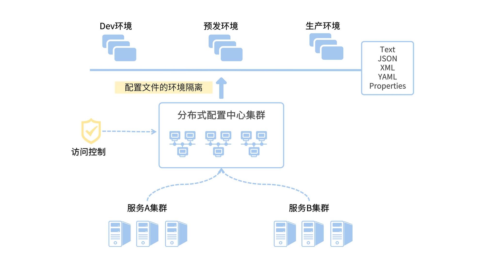

# 15 | 配置中心在微服务中发挥着怎样的作用？
你好，我是姚秋辰。

在微服务架构中，我们会使用一个分布式的“配置中心”来管理所有的配置文件和配置项。相比于传统的基于文件的配置管理方式，配置中心有什么独特的功能和优势呢？今天这节课，我就带你了解Nacos配置中心的特性，以及这些特性在微服务体系中所发挥的作用。

在Spring Boot应用中，我们习惯于使用传统的配置管理方式，将各种配置项都维护在application.yml或application.properties文件中。从完成业务逻辑的角度来看，这样做是没问题的。但在微服务架构中，我们可以采取一种更“优雅”的方式组织配置文件，实现高效灵活的配置管理。

我要先带你回想一下传统的配置管理途径都有哪些，这些途径在使用上有哪些弊端。然后，我们再来了解微服务架构下的“配置中心”是如何解决这些问题的。

## 传统配置管理的弊端

我们通常可以采用四种途径在程序中指定配置项，它们分别是硬编码、配置文件、环境/启动变量、数据库动态获取，我们先来了解一下这四种配置管理方式是如何实现的。

- 硬编码：最简单粗暴的方式，在Bean初始化的上下文中，直接通过在代码中hardcode的方式指定配置信息；
- 配置文件：使用application和bootstrap配置文件来设置配置项，这是目前比较“优雅”常用的方式；
- 环境/启动变量：通过操作系统的环境变量，或者启动命令中的-D参数传入配置项；
- 数据库/缓存动态获取：将配置项保存在数据库里，每次执行一个select语句实现动态查询。

看似我们有了不少办法来实现配置管理，但实际上，以上的几种途径或多或少都有一些弊端。

**从职责分离的角度来讲**，硬编码无法将“业务逻辑”与“配置管理”拆分开来。尽管硬编码实现起来最为简单，它仍然是我最不推荐的一种方式。

**从灵活性的角度来讲**，无论你用的是硬编码、配置文件还是环境/启动变量的方式，只要你需要对配置项进行变更，你就必须对代码/启动命令进行修改，然后重新打包并部署应用，无法做到在运行期灵活变更配置项。

数据库/缓存动态获取的方式和上面几种相比，具备了一定的灵活性。 **但从版本控制的角度来看**，配置项也是一种“代码资源”，采用数据库/缓存控制并不能很好地实现配置版本的控制和历史版本回滚。而面对高并发场景时，如果我们采用数据库方案，还要时刻关注DB的性能指标，以免被流量打崩。

除此以外， **多格式支持和安全性** 也是需要考虑的因素。对于用户名密码之类的敏感数据，如果明目张胆地放在代码库中，那么将显著增加“删库跑路”事件的发生几率。

到这里你会发现，传统的配置管理方式或多或少都存在着一些弊端。你也可能会问，分布式配置中心可以解决这些问题吗？答案是当然。接下来，我就带你了解分布式配置中心有哪些具体的作用。

## 分布式配置中心

在微服务的架构体系中，我们会使用一个中心化的分布式配置中心作为配置文件的管理者。

在应用程序端，我们只将一些必要的配置项添加到配置文件中（如application.yml和bootstrap.yml），而大部分的配置项都被保存在配置中心集群里。客户端在启动的时候从配置中心获取所有的配置项，用于各个组件的初始化。

我以下节课将要学习的Nacos Config为例，画了一张架构图来帮你理解这个过程，你可以参考一下。

从上面的图中，你可以看到分布式配置中心在配置管理方面发挥的作用，接下来我就为你展开讲一讲。

**高可用性：** 微服务组件的高可用性是首要目标。配置中心并不是一个中心化的单点应用，而是一个通过集群对外提供服务的组件。在一致性算法的基础上，集群中各个节点之间会互相同步配置数据，或者从统一数据源读取配置数据。即便个别节点挂掉，也不影响整个集群的可用性；

**环境隔离特性**：Nacos支持通过Namespace属性指定当前配置项所在的环境，你可以为自己的应用系统创建开发环境、预发环境和生产环境，不同环境之间的配置文件是相互隔离的；

**多格式支持**：Nacos支持多种不同格式的配置内容，你可以使用纯文本、JSON、XML、YAML和Properties多种文件后缀；

**访问控制**：Nacos实现了权限管理功能，你可以在控制台创建用户账号和权限组，限制某个账号可以访问哪些命名空间，并配置账号的读写权限（只读、只写、读写）。通过这种方式，你可以保障敏感信息（如数据库用户名和密码）的安全；

**职责分离**：配置项从jar包中抽离了出来，修改配置项再也不需要重新编译打包应用程序了，完美实现了配置项管理与业务代码之间的职责分离；

**版本控制和审计功能**：配置项也是一种代码，而且配置bug往往比代码中的bug造成的影响更大。因此，在微服务架构中我们需要确保配置中心具备完善的版本控制和审计功能。

从图中你可以看出，通过Nacos的“历史版本”功能，你可以查看任何一个配置文件的历史修改记录，包括改动的时间和操作人。针对每一个改动记录，我们可以查看这一版本的配置详情，或者做线上配置项的回滚操作。

除了上面我们提到的功能以外，Nacos还可以支持 **多文件源读取以及运行期配置变更**。尤其是 **动态变更推送**，更是微服务架构下不可或缺的配置管理能力。

Nacos具备很高的灵活性，你可以在项目中指定从多个Nacos配置文件中获取信息，这些文件可以是不同名称、不同格式的配置文件。这个特性允许你对配置文件做更细致的“职责隔离”。比如你可以把Redis连接信息做成一个独立的配置文件，让集群中的所有应用消费同一个文件来初始化Redis Connection。

当配置项发生变化的时候，服务端可以通过监听变更事件的方式，从Nacos服务器获取到最新的配置信息。这个功能就是 **配置项动态更新**， **它可以让你在不重启应用程序的前提下更新配置信息**，这在微服务系统中大有用途。

我来列举几个配置项动态更新的使用场景，帮助你理解它的作用。

**业务开关**

动态配置的一个作用是通过业务开关控制功能的开启/关闭。比如在做主链路规划的时候，我们经常需要在一些非关键服务上预留一个“人工降级”开关，在业务运行期对特定业务做定向熔断。

对于一些大需求点的功能更新，经常涉及到上下游多个微服务的改动，但每个微服务的上线时间往往是不一样的。这时候我们就可以在代码中预留一个“业务开关”，在当前服务上线之初，开关处于关闭状态，待所有上下游服务都完成了上线之后，再通过开关开启新功能。如果出现异常情况，还可以通过这个功能开关切换回老的执行逻辑。

**业务规则更新**

对于一些更新比较频繁的业务数据，我们可以把这部分数据放到配置中心中。比如说我在搭建新零售平台的商品中心的时候，会将一些运营文案信息部署到配置中心。这样一来，我们就可以根据运营活动随时更新资源位的布局、样式以及展位商品。

**灰度发布验证**

如果你即将发布新的配置项变更，但是在应用到整个集群之前你想先挑几台服务器测试一下，那么你可以使用Nacos的Beta发布功能，将配置项定向推送到特定IP地址的Client机器，完成线上测试。利用Beta发布+业务开关的组合，你还可以在线上定向开启特定IP服务器的业务开关，实现轻量级的灰度测试。

到这里，相信你已经对配置中心在微服务中的应用场景有了比较全面的认识。现在，我们来回顾一下这节课的重点内容。

## 总结

今天我们了解了配置中心在微服务架构下的使用场景。对于开发人员来说，“ **动态属性推送**”应该是我们在工作中最常用到的功能点了，尤其在拥抱变化的互联网公司更是如此。因为互联网行业的需求变动非常频繁， **如何巧妙地利用配置中心的动态推送功能，将“变化的需求部分”和“不变的代码部分”隔离开来**，是开发业务场景时需要着重考虑的。

我来举一个例子，很多电商APP上都有商品资源位，根据各种活动场景的不同，这些资源位的样式和排版都会根据运营要求发生变化。大多数开发人员可能会以为这些页面排版和背景图之类的活动页面是通过代码写死的，其实不然。面对玩法花样多变的运营场景，我们会把资源位抽象成不同的模板，将模板添加到配置中心里，客户端程序根据不同模板做布局适配即可。这样一来，不管是618、双11还是双12，只需要更改配置中心的模板内容就可以更改APP端页面布局，省去了重新发版的工作。（当然了，APP端要基于H5构建，不能基于Native）。

在下节课里，我将带你集成应用程序到Nacos配置中心，并实现属性动态推送的场景。

## 思考题

通过这节课的学习，你能想一下动态属性推送还有哪些应用场景吗？如果你的项目也使用了动态推送功能，欢迎你在评论区将你的业务场景分享出来。

好啦，这节课就结束啦。欢迎你把这节课分享给更多对Spring Cloud感兴趣的朋友。我是姚秋辰，我们下节课再见！