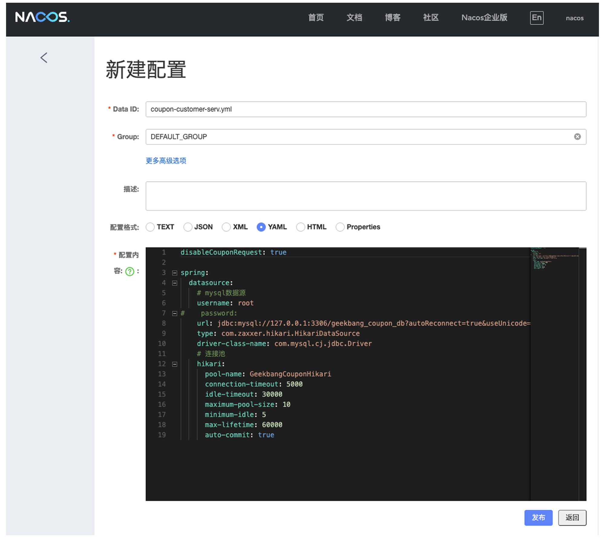

# 16 | 如何集成 Nacos Config 实现配置项动态刷新？
你好，我是姚秋辰。

在上一节课，你已经了解了配置中心在微服务架构中的作用和应用场景。今天我们就来学习如何让应用程序从Nacos分布式配置中心获取配置项。通过这节课的学习，你可以掌握微服务架构下的配置管理方式，知道如何通过动态配置推送来实现业务场景。

今天课程里将要介绍的动态推送是互联网公司应用非常广泛的一个玩法。我们都知道互联网行业比较卷，卷就意味着业务更新迭代特别频繁。

就拿我以前参与的新零售业务为例，运营团队三天两头就要对线上业务进行调整，为了降低需求变动带来的代码改动成本，很多时候我们会将一些业务抽离成可动态配置的模式，也就是 **通过动态配置改变线上业务的表现方式**。比如手机APP上的商品资源位的布局和背景等，这些参数都可以通过线上的配置更新进行推送，不需要代码改动也不需要重启服务器。

接下来，我先来带你将应用程序接入到Nacos获取配置项，然后再来实现动态配置项刷新。本节课我选择coupon-customer-serv作为改造目标，因为customer服务的业务场景比较丰富，便于我们来演示各个不同的场景和用法。

接入Nacos配置中心的第一步，就是要添加Nacos Config和Bootstrap依赖项。

## 添加依赖项

我们打开coupon-customer-serv的pom文件，在pom中添加以下两个依赖项。

```
<!-- 添加Nacos Config配置项 -->
<dependency>
    <groupId>com.alibaba.cloud</groupId>
    <artifactId>spring-cloud-starter-alibaba-nacos-config</artifactId>
</dependency>

<!-- 读取bootstrap文件 -->
<dependency>
    <groupId>org.springframework.cloud</groupId>
    <artifactId>spring-cloud-starter-bootstrap</artifactId>
</dependency>

```

第一个依赖项是Nacos配置中心的依赖包。尽管我们在 [第9节课](https://time.geekbang.org/column/article/473988) 中已经在customer服务中添加过了Nacos的依赖项，但此依赖项非彼依赖项，初学者很容易搞混。Nacos既能用作配置管理也能用作服务注册，如果你想要引入Nacos的 **服务发现功能**， **需要添加的是nacos-discovery包**；而如果你想引入的是Nacos的 **配置管理功能**， **则需要添加nacos-config包**。

第二个依赖项是为了让程序在启动时能够加载本地的bootstrap配置文件，因为Nacos配置中心的连接信息需要配置在bootstrap文件，而非application.yml文件中。在Spring Cloud 2020.0.0版本之后，bootstrap文件不会被自动加载，你需要主动添加spring-cloud-starter-bootstrap依赖项，来开启bootstrap的自动加载流程。

为什么集成Nacos配置中心必须用到bootstrap配置文件呢？这就要说到Nacos Config在项目启动过程中的优先级了。

如果你在Nacos配置中心里存放了访问MySQL数据库的URL、用户名和密码，而这些数据库配置会被用于其它组件的初始化流程，比如数据库连接池的创建。为了保证应用能够正常启动，我们必须 **在其它组件初始化之前从Nacos读到所有配置项**，之后再将获取到的配置项用于后续的初始化流程。

因此，在服务的启动阶段，你需要通过某种途径将Nacos配置项加载的优先级设置为最高。

而在Spring Boot规范中，bootstrap文件通常被用于应用程序的上下文引导，bootstrap.yml文件的加载优先级是高于application.yml的。如果我们将Nacos Config的连接串和参数添加到bootstrap文件中，就能确保程序在启动阶段优先执行Nacos Config远程配置项的读取任务。这就是我们必须将Nacos Config连接串配置在bootstrap中的原因。

依赖项添加完成之后，我们就可以去配置Nacos Config的连接串了。

## 添加本地Nacos Config配置项

首先，我们需要在coupon-customer-impl项目的resource文件夹中创建bootstrap.yml配置文件。

接下来，你需要在bootstrap.yml文件中添加一些Nacos Config配置项，我把一些常用的配置项写到了这里，你可以参考一下。

```
spring:
  # 必须把name属性从application.yml迁移过来，否则无法动态刷新
  application:
    name: coupon-customer-serv
  cloud:
    nacos:
      config:
        # nacos config服务器的地址
        server-addr: localhost:8848
        file-extension: yml
        # prefix: 文件名前缀，默认是spring.application.name
        # 如果没有指定命令空间，则默认命令空间为PUBLIC
        namespace: dev
        # 如果没有配置Group，则默认值为DEFAULT_GROUP
        group: DEFAULT_GROUP
        # 从Nacos读取配置项的超时时间
        timeout: 5000
        # 长轮询超时时间
        config-long-poll-timeout: 10000
        # 轮询的重试时间
        config-retry-time: 2000
        # 长轮询最大重试次数
        max-retry: 3
        # 开启监听和自动刷新
        refresh-enabled: true
        # Nacos的扩展配置项，数字越大优先级越高
        extension-configs:
          - dataId: redis-config.yml
            group: EXT_GROUP
            # 动态刷新
            refresh: true
          - dataId: rabbitmq-config.yml
            group: EXT_GROUP
            refresh: true

```

下面，我就带你了解一下代码中的的配置项，我把这些配置项分为了几大类，我们分别来看一下。

**文件定位配置项**：主要用于匹配Nacos服务器上的配置文件。

- namespace：Nacos Config的namespace和Nacos服务发现阶段配置的namespace是同一个概念和用法。我们可以使用namespace做多租户（multi-tenant）隔离方案，或者隔离不同环境。我指定了namespace=dev，应用程序只会去获取dev这个命名空间下的配置文件；
- group：概念和用法与Nacos服务发现中的group相同，如未指定则默认值为DEFAULT\_GROUP，应用程序只会加载相同group下的配置文件；
- prefix：需要加载的文件名前缀，默认为当前应用的名称，即 spring.application.name，一般不需要特殊配置；
- file-extension：需要加载的文件扩展名，默认为properties，我改成了yml。你还可以选择xml、json、html等格式。

**超时和重试配置项**

- timeout：从Nacos读取配置项的超时时间，单位是ms，默认值3000毫秒；
- config-retry-time：获取配置项失败的重试时间；
- config-long-poll-timeout：长轮询超时时间，单位为ms；
- max-retry：最大重试次数。

在这里，我想多跟你介绍一下超时和重试配置里提到的 **长轮询机制** 的工作原理。

当Client向Nacos Config服务端发起一个配置查询请求时，服务端并不会立即返回查询结果，而是会将这个请求hold一段时间。如果在这段时间内有配置项数据的变更，那么服务端会触发变更事件，客户端将会监听到该事件，并获取相关配置变更；如果这段时间内没有发生数据变更，那么在这段“hold时间”结束后，服务端将释放请求。

采用长轮询机制可以降低多次请求带来的网络开销，并降低更新配置项的延迟。

**通用配置**

- server-addr：Nacos Config服务器地址；
- refresh-enabled: 是否开启监听远程配置项变更的事件，默认为true。

**扩展配置**

- extension-configs：如果你想要从多个配置文件中获取配置项，那么你可以使用extension-configs配置多源读取策略。extension-configs是一个List的结构，每个节点都有dataId、group和refresh三个属性，分别代表了读取的文件名、所属分组、是否支持动态刷新。

在实际的应用中，我们经常需要将一个公共配置项分配给多个微服务使用，比如多个服务共享同一份Redis、RabbitMQ中间件连接信息。这时我们就可以在Nacos Config中添加一个配置文件，并通过extension-configs配置项将这个文件作为扩展配置源加到各个微服务中。这样一来，我们就不需要在每个微服务中单独管理通用配置了。

到这里，相信你已经了解了各个常用配置项的用途。那么接下来，让我们去Nacos Config中添加配置文件吧。

## 添加配置文件到Nacos Config Server

首先，我们在本地启动Nacos服务器，打开配置管理模块下的“ **配置列表**”页面，再切换到“ **开发环境**”命名空间下（即dev环境）。


然后，我们点击页面右上角的➕符号创建三个配置文件，coupon-customer-serv.yml（默认分组）、redis-config.yml（EXT\_GROUP分组）和rabbitmq-config.yml（EXT\_GROUP分组）。

接下来，你就可以将原本配置在本地application.yml中的配置项转移到Nacos Config中了，由于Data ID后缀是yml，所以在编辑配置项的时候，你需要在页面上选择“YAML”作为配置格式。

以coupon-customer-serv.yml为例，在新建配置的页面中，我指定了Data ID为coupon-customer-serv.yml、Group为默认分组DEFAULT\_GROUP、配置格式为YAML。在“配置内容”输入框中，我将spring.datasource的配置项添加了进去。除此之外，我还添加了一个特殊的业务属性：disableCouponRequest:true，待会儿你就会用到这个属性实现 **动态业务开关推送**。



填好配置项的内容之后，你就可以点击“发布”按钮来创建配置文件了。redis-config.yml和rabbitmq-config.yml两个配置文件将在后面的章节中用到，我们目前还不需要向这两个文件中添加配置项。

一切配置妥当之后，我们就可以去启动应用程序来验证集成效果了。为了测试应用程序能否正确读取远程配置项，你可以打开coupon-customer-impl模块的application.yml文件，将其中的datasource相关配置注释掉，然后尝试重新启动服务。如果项目启动正常，你将会在日志文件看到配置文件的订阅通知。

```
INFO c.a.n.client.config.impl.ClientWorker    : [fixed-localhost_8848-dev] [subscribe] coupon-customer-serv.yml+DEFAULT_GROUP+dev

INFO c.a.nacos.client.config.impl.CacheData   : [fixed-localhost_8848-dev] [add-listener] ok, tenant=dev, dataId=coupon-customer-serv.yml, group=DEFAULT_GROUP, cnt=1

// 省略其它配置文件的加载日志

```

接下来你可以尝试调用本地数据库的CRUD接口，如果业务正常运作，那么就说明你的程序可以从Nacos Config中获取到正确的数据库配置信息。

你可以使用同样的方法，将一些配置项信息迁移到Nacos Config中。当你需要更改配置项的时候，就不用每次都重新编译并发布应用了，只需要改动Nacos Config中的配置即可。这样一来，我们就实现了 **“配置管理”与“业务逻辑”的职责分离**。

别忘了，前面我还在Nacos Config中添加了一个disableCouponRequest配置项，接下来我就用它做一个动态配置推送的场景，控制用户领券功能的打开和关闭。

## 动态配置推送

首先，我们打开CouponCustomerController类，声明一个布尔值的变量disableCoupon，并使用@Value注解将Nacos配置中心里的disableCouponRequest属性注入进来。

```
@Value("${disableCouponRequest:false}")
private Boolean disableCoupon;

```

在上面的代码中，我们给disableCouponRequest属性设置了一个默认值“false”，这样做的目的是加一层容错机制。即便Nacos Config连接异常无法获取配置项，应用程序也可以使用默认值完成启动加载。

然后，我们找到用户领券接口requestCoupon，在其中添加一段业务逻辑，根据disableCoupon属性的值控制是否发放优惠券，如果值为“true”则暂停领券。

```
@PostMapping("requestCoupon")
public Coupon requestCoupon(@Valid @RequestBody RequestCoupon request) {
    if (disableCoupon) {
        log.info("暂停领取优惠券");
        return null;
    }
    return customerService.requestCoupon(request);
}

```

最后， **别忘了在CouponCustomerController类头上添加一个RefreshScope注解**，有了这个注解，Nacos Config中的属性变动就会动态同步到当前类的变量中。如果不添加RefreshScope注解，即便应用程序监听到了外部属性变更，那么类变量的值也不会被刷新。

```
@RefreshScope
public class CouponCustomerController {
}

```

到这里，我们就完成了所有改造工作。你可以启动应用程序，然后登录Nacos控制台并打开coupon-customer-serv.yml文件的编辑窗口，将disableCouponRequest的值由true改为false，并调用requestCoupon服务查看接口逻辑的变化。我录了一段在Nacos Config控制台动态编辑配置项的video，你可以参考一下。

## 总结

现在，我们来回顾一下这节课的重点内容。今天我们使用Nacos Config作为配置中心，实现了 **配置项和业务逻辑的职责分离**，然后落地了一个 **动态属性推送** 的场景。

配置中心还有一个重要功能是“配置回滚”。如果你错误地修改了某些业务项，引起了系统故障，这时候你可以执行一段rollback操作，将配置项改动退回到之前的某一个历史版本。在Nacos控制台的“配置管理->历史版本”菜单中，你可以查看某个配置项的历史修改记录，并指定回滚的版本。

除此之外，我们还可以在Nacos上查看某个文件的监听列表，了解目前有多少实例监听了指定配置文件的动态改动事件。你可以点击“配置管理->监听查询”来访问这个功能。

上面两个功能的操作非常简单，就留给你来自己探索啦。

## 思考题

你知道RefreshScope动态刷新背后的实现原理吗？欢迎在留言区写下自己的思考，与我一起讨论。

好啦，这节课就结束啦。欢迎你把这节课分享给更多对Spring Cloud感兴趣的朋友。我是姚秋辰，我们下节课再见！