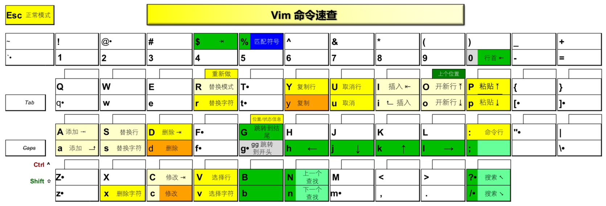
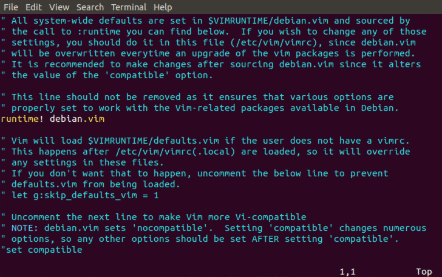
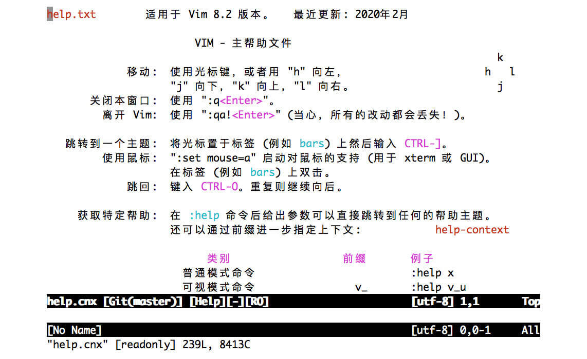
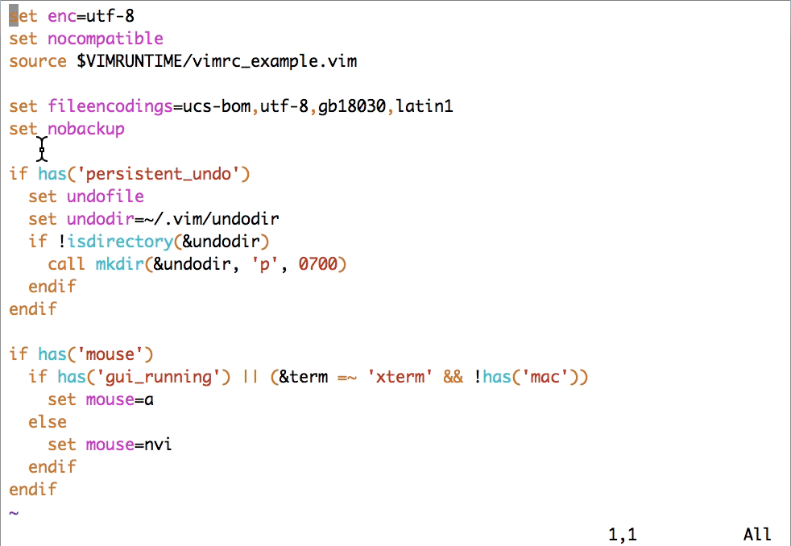
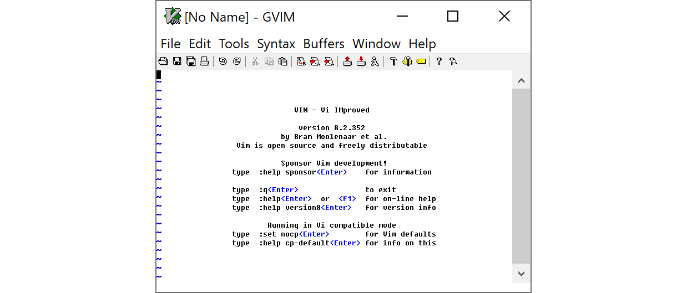
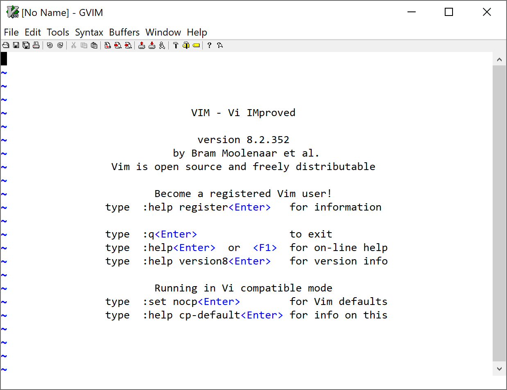
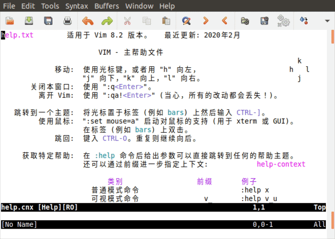

# 02｜基本概念和基础命令：应对简单的编辑任务
你好，我是吴咏炜。

这一讲，我们会讨论 Vim 的基本概念和配置。先强调一下，请务必确保你在学习这一讲之前，已经通过 Vim 教程熟悉了 Vim 的基本用法。

## Vim 教程的内容概要

上节课我给你留的作业，就是花时间学习一下 Vim 教程，下面我们就来检验一下。只有你自己先对照着教程操作了一遍，今天我再带着你过一遍里面的基本概念和配置，你才能查漏补缺，发现自己遇到的问题，明确自己需要多加练习的地方。

好，现在请查看下面的键盘图。简单说明一下，这张图上展示了一个键盘。图中的“•”表示，单个字母不是完整的命令，必须再有进一步的输入。比如，单个“g”没有意义，而“gg”表示跳转到文件开头。（对于命令后面明确跟一个动作的，如“c”，我们不使用“•”。）一个键最多有三排内容：最底下是直接按键的结果，中间是按下 Shift 的结果（变大写），上面偏右的小字是按下 Ctrl 的结果。我们还用了一些特殊符号来表示操作的位置，如果你已经了解了这些命令的功能，你也自然就明白它们的意义了。



请检查一下有颜色的那些键，看看你是否有任何不熟悉的地方。如果看下来有让你感到陌生的内容，请复习 Vim 教程。

这张图里没有写出 Vim 的命令行命令。你现在应该已经掌握了以下这些：

- “:q!”：退出 Vim
- “:wq”：存盘退出
- “:s”：执行替换
- “:!”：执行外部命令
- “:edit”（一般缩写为 “:e”）：编辑文件
- “:w”：写文件
- “:r”：读文件
- “:help”：查看帮助
- 使用键 Ctrl-D 和 Tab 来进行命令行补全

同样，如果你发现上面列举的命令有你不熟悉的，也请重新打开 Vim 教程复习一下——这些属于 Vim 的最基本功能，一定要能熟练运用才行。

## Vim 的模式

接下来我们进入本讲的正题，讲述 Vim 的四种主要模式、键描述的体例和 Vim 需要的基本配置选项。掌握了这些内容之后，我们就能应对基本的编辑任务了。下面我们一一来看。

Vim 最特别的地方就是它的模式了。与其他大部分编辑器不同，进入 Vim 后，缺省状态下键入的字符并不会插入到所编辑的文件之中。 Vim 的模式（mode，可以简单地理解为“状态”）是它的麻烦所在，但同时也是它的威力所在。

我们需要知道，Vim 有以下四种主要模式:

- 正常（normal）模式（也称为普通模式），缺省的编辑模式；如果不加特殊说明，一般提到的命令都直接在正常模式下输入；在任何其他模式中，都可以通过键盘上的 Esc 键回到正常模式。
- 插入（insert）模式，输入文本时使用；比如在正常模式下键入 i（insert）或 a（append）即可进入插入模式。
- 可视（visual）模式，用于选定文本块；教程中已经提到可以用键 v（小写）来按字符选定，Vim 里也提供其他不同的选定方法，包括按行和按列块。
- 命令行（command-line）模式，用于执行较长、较复杂的命令；在正常模式下键入冒号（:）即可进入该模式；使用斜杠（/）和问号（?）开始搜索也算作命令行模式。命令行模式下的命令要输入回车键（Enter）才算完成。

此外，Vim 也有个选择（select）模式，与普通的 Windows 编辑器行为较为接近，选择内容后再输入任何内容，将会替换选择的内容。在以可视模式和选择模式之一选定文本块之后，可以使用 Ctrl-G 切换到另一模式。这个模式主要是为了模拟 Windows 编辑器的行为，并不是 Vim 的主要用法，使用它反而会给 Vim 里的自动化带来麻烦，所以我们也就不多作介绍了。

关于 Vim 的模式，我们重点掌握正常模式就可以了，刚刚也说过，Vim 里的大部分操作会在正常模式下完成。如果你做编辑工作时有超过几秒的停顿，就应当考虑按下 Esc 键，回到正常模式。记住，正常模式就是正常情况下你应当处于的模式。😄

## Vim 的键描述体例

清楚了 Vim 模式之后，我们来对 Vim 里的按键作一下清晰的体例描述，毕竟，Vim 里的键真的有点多。

从现在开始，我会使用 Vim 里的标准键描述方式来讲解。根据 Vim 的一般习惯，我们使用尖括号来描述特殊的输入序列。下面我会提供一个列表，给出常用键的表示方式及在动图中的显示方式。这部分内容不需要记住，你用的时候作为参考就行。

- `<Esc>` 表示 Esc 键；显示为“⎋”
- `<CR>` 表示回车键；显示为“↩”
- `<Space>` 表示空格键；显示为“␣”
- `<Tab>` 表示 Tab 键；显示为“⇥”
- `<BS>` 表示退格键；显示为“⌫”
- `<Del>` 表示删除键；显示为“⌦”
- `<lt>` 表示 < 键；显示为“<”
- `<Up>` 表示光标上移键；显示为“⇡”
- `<Down>` 表示光标下移键；显示为“⇣”
- `<Left>` 表示光标左移键；显示为“⇠”
- `<Right>` 表示光标右移键；显示为“⇢”
- `<PageUp>` 表示 Page Up 键；显示为“⇞”
- `<PageDown>` 表示 Page Down 键；显示为“⇟”
- `<Home>` 表示 Home 键；显示为“↖”
- `<End>` 表示 End 键；显示为“↘”
- `<F1>` \- `<F12>` 表示功能键 1 到 12；显示为“F1”到“F12”
- `<S-…>` Shift 组合键；显示为“⇧”（较少使用，因为我们需要写 `!` 而不是 `<S-1>`；和特殊键组合时仍然有用）
- `<C-…>` Control 组合键；显示为“⌃”
- `<M-…>` Alt 组合键；显示为“⌥”（对于大部分用户，它的原始键名 Meta 应该只具有历史意义）
- `<D-…>` Command 组合键；显示为“⌘”（Mac 键盘）

现在回到前面的模式部分，我们提到的 Esc、Enter、v、V 和 Ctrl-V，按我们现在的描述惯例，以后就会写成 `<Esc>`、 `<CR>`、 `v`、 `V` 和 `<C-V>`。这也是以后在 Vim 里对键进行重映射的写法——如果你还不了解重映射是什么也没关系，我们很快就会讨论到。

这里我要强调一下，对“ `<`”的特殊解释仅在描述输入时生效。在描述命令行和代码时，我们写“ `<CR>`”仍表示四个字符，而非回车键。特别是，如果我们描述的命令行首是“:”，表示这是一个输入 `:` 开始的 Vim 命令行模式命令（以回车键结束）；如果行首是“/”或“?”，表示这是一个输入 `/` 或 `?` 开始的搜索命令（以回车键结束）；如果行首是“ `$`”，表示这是一个在 shell 命令行上输入的命令（以回车键结束），“ `$`”（和后面的空格）不是命令的一部分，通常后续行也不是命令的一部分，除非行尾有“\\”或“^”字符，或行首有“ `$`”字符。

也就是说，下面的命令是在 Vim 里输入“ `:set ft?<CR>`”（用来显示当前编辑文件的文件类型）：

```vim
:set ft?

```



下面的命令则是在 shell 里输入“ `which vim<CR>`”（用来检查 `vim` 命令的位置）：

```text
$ which vim
/usr/bin/vim

```


此外，当我用“ [`:help`](https://yianwillis.github.io/vimcdoc/doc/help.html)”描述帮助命令时，你不仅可以在 Vim 里输入这个命令来得到帮助，也可以点击这个帮助的链接，直接在线查看相应的中文帮助页面。



这节内容不需要死记。建议使用“收藏”功能，这样，你可以在以后碰到不认识的符号标记的时候，返回来查看这一节的内容。

## Vim 的选项和配置

了解了 Vim 模式和键描述，我们对 Vim 的认识又多了一些，第一步的学习成就达成。要想更好地使用 Vim，下一个关键点就是配置了，接下来我就带你看看 Vim 配置都有哪些需要注意的点。

作为一个可以越用越顺手的应用程序，Vim 是需要配置的。我们才刚开始学习，所以目前我们的配置文件是相当简单的，但随着课程的进展和你使用 Vim 越来越多，你的 Vim 配置文件必然会越变越复杂。我们今天就先来做一些初步的讨论，看看能实际使用的一个最基本 Vim 配置文件是什么样子。

我们上节课已经讨论过，根据 Unix 下的惯例，Vim 的配置文件放在用户的主目录下，文件名通常是 .vimrc；而它在 Windows 下名字是 \_vimrc。我们前面给出最基本的配置文件是这个样子的：

```vim
set enc=utf-8
set nocompatible
source $VIMRUNTIME/vimrc_example.vim

```

如果你熟悉 shell 语法，你肯定能看到不少熟悉的影子在里面。这三行完成了下列功能：

- 设置编辑文件的内码是 UTF-8（非所有平台缺省，但为编辑多语言文件所必需）
- 设置 Vim 不需要和 vi 兼容（仅为万一起见，目前大部分情况下这是缺省情况）
- 导入 Vim 的示例配置（这会打开一些有用的选项，如语法加亮、搜索加亮、命令历史、记住上次的文件位置，等等）

对于现代 Unix 系统上的 Vim 8，实际上只需要最后一句就足够了。对于现代 Windows 系统上的 Vim 8，中间的这句 `set nocompatible` 也可以删除。如果你在较老的 Vim 版本上进行配置，那么把这三行全放进去会比较安全。

接下来，我会讲一些基本的配置项，保证你的日常工作流顺畅。它们是：备份和跨会话撤销、鼠标支持、中文支持及图形界面的字体支持。除了字体支持主要牵涉到美观性，其他三项都是对编辑至关重要的基本功能。我们一一来看。

### 备份和撤销文件

上面的基本设置会产生一个有人喜欢、但也有很多人感到困惑的结果：你修改文件时会出现结尾为“~”的文件，有文件名后面直接加“~”的，还有前面加“.”后面加“.un~”的。这是因为在示例配置里，Vim 自动设置了下面两个选项：

```vim
set backup
set undofile

```

前一个选项使得我们每次编辑会保留上一次的备份文件，后一个选项使得 Vim 在重新打开一个文件时，仍然能够撤销之前的编辑（undo），这就会产生一个保留编辑历史的“撤销文件”（undofile）了。


我的通常做法是，不产生备份文件，但保留跨会话撤销编辑的能力；因为有了撤销文件，备份其实也就没有必要了。同时，把撤销文件放在用户个人的特定目录下，既保证了安全，又免去了其他目录下出现不必要文件的麻烦。

要达到这个目的，我在 Linux/macOS 下会这么写：

```vim
set nobackup
set undodir=~/.vim/undodir

```

在 Windows 下这么写：

```vim
set nobackup
set undodir=~\vimfiles\undodir

```

无论哪种环境，你都需要创建这个目录。我们可以用下面的命令来让 Vim 在启动时自动创建这个目录：

```vim
if !isdirectory(&undodir)
  call mkdir(&undodir, 'p', 0700)
endif

```

如果我告诉你， `&undodir` 代表 `undodir` 这个选项的值，那么其他代码的基本作用，相信你也一定能看出来了吧？我们暂时就不做进一步分析了。如果你好奇的话，可以提前看一下下面各项的 Vim 帮助文档：

- [`:help isdirectory()`](https://yianwillis.github.io/vimcdoc/doc/eval.html#isdirectory%28%29)
- [`:help mkdir()`](https://yianwillis.github.io/vimcdoc/doc/eval.html#mkdir%28%29)
- [`:help :call`](https://yianwillis.github.io/vimcdoc/doc/eval.html#:call)

这个跨会话撤销的能力，我还真不知道其他哪个编辑器也有。更妙的是，Vim 还有撤销树的概念，可以帮助你回到任一历史状态。这个我们以后会和相关的插件一起讨论。

### 鼠标支持

我不知道你会不会像某些资深 Vim 用户一样，只用键盘不用鼠标。我反正是做不到的，也没有动力去那样做——毕竟，浪费计算机界一项伟大的发明并不那么有必要😂。手一直在键盘上的本位排（home row）打字当然会更快，但一个程序员看代码的时间比写代码的时间要多得多，而在非线性的跳转任务上，鼠标比键盘更加快，也更加有效。

在 Vim 的终端使用场景下，鼠标的选择有一定的歧义：你希望是使用 Vim 的可视模式选择内容，并且只能在 Vim 里使用呢，还是产生 Vim 外的操作系统的文本选择，用于跟其他应用程序的交互呢？这是一个基本的使用问题，两种情况都可能发生，都需要照顾。

如果你使用 xterm 兼容终端的话，通常的建议是：

- 在不按下修饰键时，鼠标选择产生 Vim 内部的可视选择。
- 在按下 Shift 时，鼠标选择产生操作系统的文本选择。

对于不兼容 xterm、不支持对 Shift 键做这样特殊处理的终端，我们一般会采用一种“绕过”方式，让 Vim 在某种情况下暂时不接管鼠标事件。通常的选择是在命令行模式下不使用鼠标。下面，我们就分这两种情况来配置。

虽然最新的 Vim 缺省配置文件（示例配置文件会包含缺省配置），在大部分情况下已经可以自动设置合适的鼠标选项了，不过为照顾我们课程的三种不同平台，我们还是手工设置一下：

```vim
if has('mouse')
  if has('gui_running') || (&term =~ 'xterm' && !has('mac'))
    set mouse=a
  else
    set mouse=nvi
  endif
endif

```

上面代码说的是，如果 Vim 有鼠标支持的话，那在以下任一条件满足时：

- 图形界面正在运行
- 终端是 xterm 兼容，并且不是 Mac（Mac 上的终端声称自己是 xterm，但行为并不完全相同）

我们将启用完全的鼠标支持（mouse=a）。特别是，此时鼠标拖拽就会在 Vim 里使用可视模式选择内容（只能在 Vim 里使用）。而当用户按下 Shift 键时，窗口系统接管鼠标事件，用户可以使用鼠标复制 Vim 窗口里的内容供其他应用程序使用。

否则（非图形界面的的终端，且终端类型不是 xterm），就只在正常模式（n）、可视模式（v）、插入模式（i）中使用鼠标。这意味着，当用户按下 `:` 键进入命令行模式时，Vim 将不对鼠标进行响应，这时，用户就可以使用鼠标复制 Vim 窗口里的内容到其他应用程序里去了。



非 xterm 的鼠标支持在 macOS 和 Windows 下都有效。但在 Windows 下需要注意的一点是，如果使用非图形界面的 Vim 的话，应当在命令提示符（Command Prompt）的属性里关闭“快速编辑模式”（QuickEdit Mode），否则 Vim 在运行时将无法对鼠标事件进行响应。

鉴于命令提示符的行为有很多怪异和不一致之处，强烈建议你在 Windows 下，要么使用图形界面的 Vim，要么使用 Cygwin/MSYS2 里、运行在 mintty 下的 Vim。

### 中文支持

接下来我和你讲讲中文支持的问题。如果你一直在 UTF-8 下使用中文的话，那这一小节的内容可以跳过。对于大部分在 Unix 下工作的人员，应该是这样的情况。而如果你在 Windows 上工作，或者有需要跟别人交换 GB2312、GBK、GB18030 编码的文本文件，那这部分的内容还是需要看一下的。

完整的 Unicode 历史和原理可以讲上整整一讲，但从实用的角度，我们就简化成下面几条吧：

- 整个世界基本上在向 UTF-8 编码靠拢。
- 微软由于历史原因，内部使用 UTF-16；UTF-16 可以跟 UTF-8 无损转换。
- GB2312、GBK、GB18030 是一系列向后兼容的中文标准编码方式，GB2312 编码的文件是合法的 GBK 文件，GBK 编码的文件是合法的 GB18030 文件。但除了 GB18030，都不能做到跟 UTF-8 无损转换；目前非 UTF-8 的简体中文文本基本上都用 GBK/GB18030 编码（繁体中文文本则以 Big5 居多）。鉴于 GB18030 是国家标准，其他两种编码也和 GB18030 兼容，我们就重点讲如何在 Vim 中支持 GB18030 了。

举一个具体的例子，“你好😄”这个字符串，在 UTF-8 编码下是下面 10 个字节（我按字符进行了分组）：

`e4bda0 e5a5bd f09f9884`

如果使用 GB18030 编码（GB2312/GBK 不能支持表情字符）的话，会编码成 8 个字节：

`c4e3 bac3 9439fd30`

这么看起来，GB18030 处理中文在存储效率上是优势的。但它也有缺点：

- GBK 外的 Unicode 字符一般需要四字节编码（非中文情况会劣化）
- GBK 外的 Unicode 字符跟 Unicode 码点需要查表才能转换（UTF-8 则可以用非常简单的条件判断、移位、与、或操作来转换）
- 一旦出现文件中有单字节发生损毁，后续的所有中文字符都可能发生紊乱（而 UTF-8 可以在一个字符之后恢复）

因此，GB18030 在国际化的软件中不会作为内码来使用，只会是读取/写入文件时使用的转换编码。我们要让 Vim 支持 GB18030 也同样是如此。由于 UTF-8 编码是有明显规律的，并非任意文件都能成功地当成 UTF-8 来解码，我们一般使用的解码顺序是：

- 首先，检查文件是不是有 Unicode 的 BOM（字节顺序标记）字符，有的话按照 BOM 字符来转换文件内容。
- 其次，检查文件能不能当作 UTF-8 来解码；如果可以，就当作 UTF-8 来解释。
- 否则，尝试用 GB18030 来解码；如果能成功，就当作 GB18030 来转换文件内容。
- 最后，如果上面的解码都不成功，就按 Latin1 字符集来解码；由于这是单字节的编码，转换必定成功。

事实上，Vim 缺省差不多就是按这样的顺序，但第三步使用何种编码跟系统配置有关。如果你明确需要处理中文，那在配置文件里最好明确写下下面的选项设定：

```vim
set fileencodings=ucs-bom,utf-8,gb18030,latin1

```

### 图形界面的字体配置

图形界面的 Vim 可以自行配置使用的字体，但在大部分环境里，这只是起到美化作用，而非必需项。不过，对于高分辨率屏幕的 Windows，这是一个必需项：Vim 在 Windows 下缺省使用的不是 TrueType 字体，不进行配置的话，字体会小得没法看。



在 Windows 的缺省字体里，一般而言，Consolas 和 Courier New 还比较合适。以 Courier New 为例，在 \_vimrc 里可以这样配置（Windows 上的基本写法是字体名称加冒号、“h”加字号；用“\_”取代空格，否则空格需要用“\\”转义）：

```vim
if has('gui_running')
  set guifont=Courier_New:h10
endif

```



字体名称如何写是件平台相关的事（可参见帮助文档“ [`:help gui-font`](https://yianwillis.github.io/vimcdoc/doc/gui.html#gui-font)”）。如果你不确定怎么写出你需要的字体配置，或者你怎么写都写不对的话，可以先使用图形界面的菜单来选择（通常是“编辑 \> 选择字体”；在 MacVim 里是“Edit > Font > Show Fonts”），然后使用命令“ `:set guifont?`”来查看。

注意，Vim 在设置选项时，空格需要用“\\”进行转义。比如，如果我们要在 Ubuntu 下把字体设成 10 磅的 DejaVu Sans Mono，就需要写：

```vim
  " Linux 和 Windows 不同，不能用 '_' 取代空格
  set guifont=DejaVu\ Sans\ Mono\ 10

```

此外，宽字符字体（对我们来讲，就是中文字体了）是可以单独配置的。这可能就更是一件仁者见仁、智者见智的事了。对于纯中文的操作系统，这一般反而是不需要配置的；但如果你的语言设定里，中文不是第一选择的话，就有可能在显示中文时出现操作系统误用日文字体的情况。这时你会想要手工选择一个中文字体，比如在 Ubuntu 下，可以用：

```vim
  set guifontwide=Noto\ Sans\ Mono\ CJK\ SC\ 11

```

注意，在不同的中英文字体搭配时，并不需要字号相同。事实上，在 Windows 和 Linux 上我通常都是使用不同字号的中英文字体的。



在上面的动图中，你可以观察到设了中文字体之后，不仅中文字变大，更美观了，“将”、“适”、“关”、“复”、“启”等字的字形也同时发生了变化。

由于字体在各平台上差异较大，字体配置我就不写到 Vim 的参考配置中去了，只把如何选择和配置的方法写出来供你参考。

## 内容小结

好了，这一讲我就讲到这里，我们来做个内容小结。

今天我给出了一张键盘图，带你复习了 Vim 教程的内容，这里我要再强调一遍，这部分的内容如果你还有不熟悉的，一定要再去学习一下 Vim 教程，这段时间我们一定要多花点时间和精力来练习，把这一步跨过去。

掌握了 Vim 教程里的基础信息还远远不够，我们还得了解 Vim 的四种主要模式，你只要记住最重要的就是正常模式就可以了。

最后我带你学习了 Vim 的几个基本配置选项，包括对撤销、鼠标、中文和字体的支持，来满足最基本的编辑需要。最终的 Vim 配置文件可以在 GitHub 上找到：

[https://github.com/adah1972/geek\_time\_vim](https://github.com/adah1972/geek_time_vim)

关于这个配置文件，我这里做个备注说明：主（master）分支可以用在类 Unix 平台上，windows 分支则用在 Windows 上。适用于今天这一讲的内容标签是 `l2-unix` 和 `l2-windows`：你可以用 `git checkout l2-unix` 或 `git checkout l2-windows` 来得到相应平台对应本讲的配置文件。

好了，掌握了今天的内容，你就可以用 Vim 做最基本的编辑了。

## 课后练习

请使用本讲的配置文件，并尝试以下操作：

- 退出 Vim 然后重新打开文件，仍然可以撤销上次的编辑。
- 使用终端的 Vim，在终端里用鼠标复制 Vim 里的文本到另外一个文本编辑器中（仅 Unix 下，可选）。
- 在 Vim 中使用“ `:help`”命令（大部分环境下也可以使用 `<F1>` 功能键），尝试查看命令说明，以及使用键盘和鼠标在帮助主题中跳转。

如果遇到任何问题，欢迎留言和我讨论。我们下一讲见。