# 15丨性能测试场景：如何进行监控设计？
在性能测试中，我觉得监控是非常重要的环节。因为这是做性能分析的前提，走出这一步，才有后面的分析。

监控是性能分析承上启下的关键点。

设计监控是我们性能测试工程师必须要做的事情。当然了，仅仅设计监控是不够的，还要看懂监控数据才能分析。我们将在后面的篇幅一一拆解。

我觉得性能测试工程师也一定要自己去实现一遍监控的环节，而不是直接用其他团队搭建的监控工具。你可以自己找个demo服务器做一遍，这样才能真正理解后续要关注的点在哪里。

之前在一个项目上，我跟团队成员说，把监控一层层部署起来。有个小姑娘提出一个疑问：“监控有什么要部署的吗？不是用JConsole就好了吗？”我说每个工具都有功能的局限性，所以要多种工具配合在一起才能有完整的数据可分析。然后我又问她这个想法从哪来的。她说之前带她的一个测试经理说的，对Java的应用，只要用JConsole监控就好了。我不知道他们的沟通上下文，但我理解如果不是这姑娘在断章取义，那就是这个测试经理引导错误了。

监控平台还指望别人给搭好，点个链接就能出数据了，这显然不是一个技术人员该有的样子。

## 监控设计步骤

如果要让性能测试人员设计监控逻辑，要如何做呢？

首先，你要 **分析系统的架构**。在知道架构中使用的组件之后，再针对每个组件进行监控。

其次，监控 **要有层次，要有步骤**。有些人喜欢一上来就把方法执行时间、SQL执行时间给列出来，直接干到代码层，让人觉得触摸到了最顶级的技能。然而在我的工作中，通常不这么做，应该是 **先全局，后定向定量分析**。

最后，通过分析全局、定向、分层的监控数据做分析，再根据分析的结果决定下一步要收集什么信息，然后找到完整的证据链。

这才是监控应该有的步骤，才能体现监控的价值。

## 监控技术图谱

这张图是我认为在一个性能测试中，该有的技术图谱。

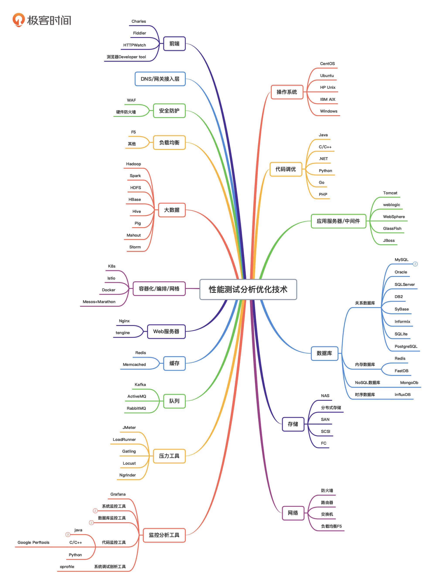

从这个图中我们可以看到，除了压力工具之外，还有很多技术细节。通常在各种场合下，我都会说，这些都是我们要学习的范围，做性能分析的人，不一定能完全能掌握这些内容，那你所在的性能团队就应该有这样的能力。因为性能团队要推进瓶颈的定位解决，所以要有和其他团队正面沟通的能力。

下面我们就以具体的操作过程来说明设计的落地过程。

现在的流行框架（比如说Spring Cloud）中的熔断监控、限流服务、服务健康检查／监控、链路监控、服务跟踪、聚合监控等等，都是非常好的监控手段。比如说下面这样的架构图：

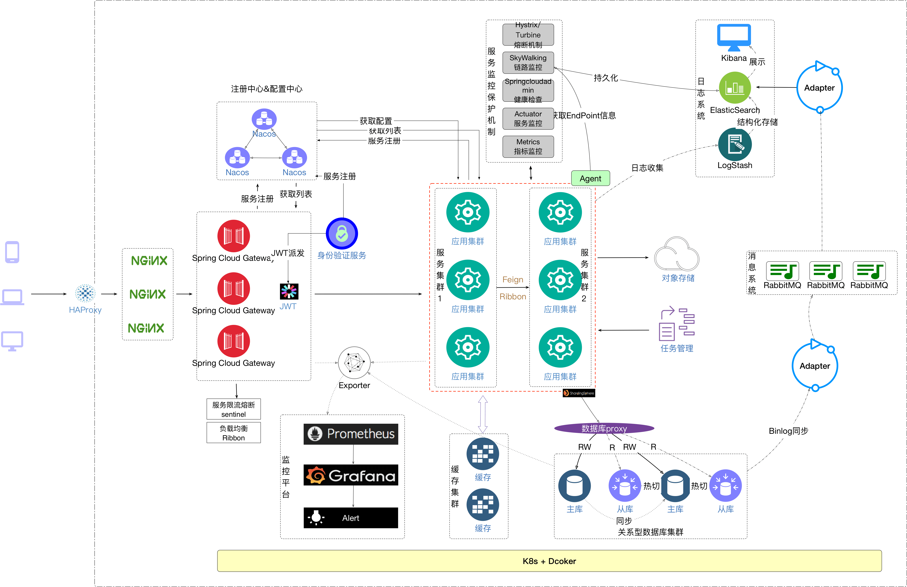

这是比较常见的微服务技术架构。其中很多开源工具已经提供了监控的能力。在网上也能找到一些部署搭建的资料，好像不提微服务、全链路就不好意思见人了似的。

对技术的发展，我们要拥抱。但对思路的梳理更为重要，因为框架平台工具都是为了实现目标而存在的。

在本篇中，我们还是回归根本，说一下监控设计的思路，讲清楚性能测试中应该如何拆分监控的点。当你看完了之后，即使是面对不同的架构，也有监控部署的思路。

## 架构图

那么我们就来到开始的位置了。做性能监控之前，先画一个最简单的架构图，看一下架构中各有什么组件，各有什么服务，将这些列下来，再找对应的监控手段和方式，看哪种手段和方式在性能测试过程中成本最低，效率最高。

如果把性能归到 **测试** 的这个阶段，那就必须先考虑 **测试** 的具体情况。

有些企业因为有长期的积累，监控平台完整又稳定，那显然是最好的。如果是短期项目类的性能测试，又涉及到多方企业的，基本上不要想有完整成熟的监控平台这件事了。

但是不管怎么样，我们都需要拿到架构的全局监控数据。针对下面的这个不大的架构，我们来考虑下如何拆分。


需要监控的内容如下：

1. 操作系统
2. Nginx
3. Tomcat
4. Redis
5. MySQL

下面我就来细化下这个简单架构的监控设计。

## 监控设计

下图可以大概说明我对监控的整体设计理念。

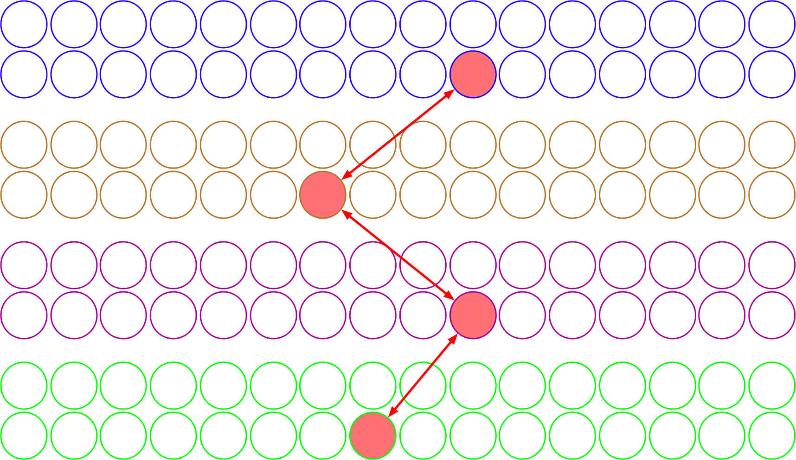

我来说明一下：

1. 我们要对整个架构做分层。
2. 在每一个层级上列出要监控的计数器。
3. 寻找相应的监控工具，实现对这些计数器的监控。如果一个工具做不到，在定位过程中考虑补充工具。
4. 要做到对每层都不遗漏。

从大的分类上来看，我们识别出每个监控的节点和层级，再对应到架构中，如下图所示：

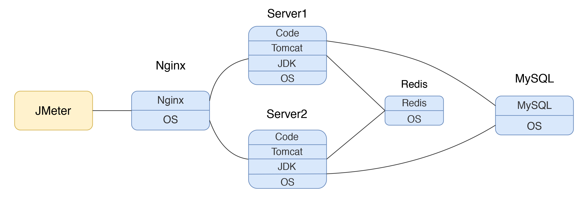

最适合的监控方式是什么样的呢？那就是成本最低，监控范围最大，效率最快。而是否持久就不再是考虑的重点了，因为项目结束了，监控工具可能也被拆了。

在企业中，我们也是首先考虑快速的监控实现。但是，还要一点要考虑，就是监控的持久有效性，能一直用下去。所以，在快速实现了之后，在必要时，会做一些二次开发，定制监控。

对了，这里再提一句，我不建议一开始就把代码级的监控给加进来。不光是因为它消耗资源，更重要的是，真的没有太大的必要。像方法的执行时间这类监控，如果没有定位到它们有问题，我们为什么要去看呢？当我们有了证据链的时候，是不是更一针见血呢？

所以最重要的是，我想看到的数据，到底能不能看得到。

对于上述的每个组件，我都建议用下面这样的监控思路。 **敲黑板！下图是重点！**


有人可能会想说：就这几个字还值当画个图吗？我觉得非常有必要。因为 **全局到定向** 的思路帮我解决了很多的问题。

## 全局监控设计

那么什么是全局监控呢？

### OS层（CentOS为例）

就拿OS来说吧，我们一般进到系统中，看的就是CPU、I/O、内存、网络的使用率，这是很常规的计数器。在很多人看来，这些计数器是可以反应出一个系统的全局健康状态的。

先不管通过这些计数器得到的结论是不是对的。我们首先要知道的是，要有这样全局监控的潜意识，之所以说潜意识，是因为很多人不知道为什么看这些，但还是这样看了。

那么实际上做一个OS的全局监控需要看多少个计数器呢？我们看下架构图。

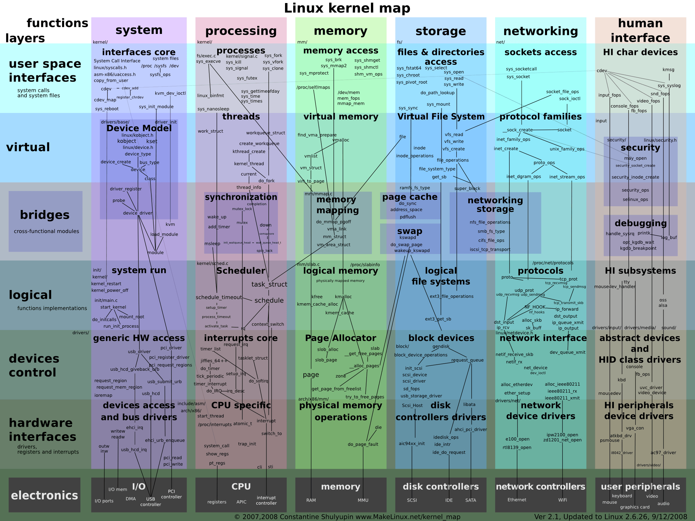

因为新版内核没有给更细的内核架构图，所以我用2.6.26版本的Linux内核架构图来说明思路。

给这张图的目的就是建议先看架构图，再考虑要监控的大分类有多少。从上图中，我们可以看到有这么几类，system、processing、memory、storage、networking等。

这里画出一个思维导图，给出我的经验计数器。

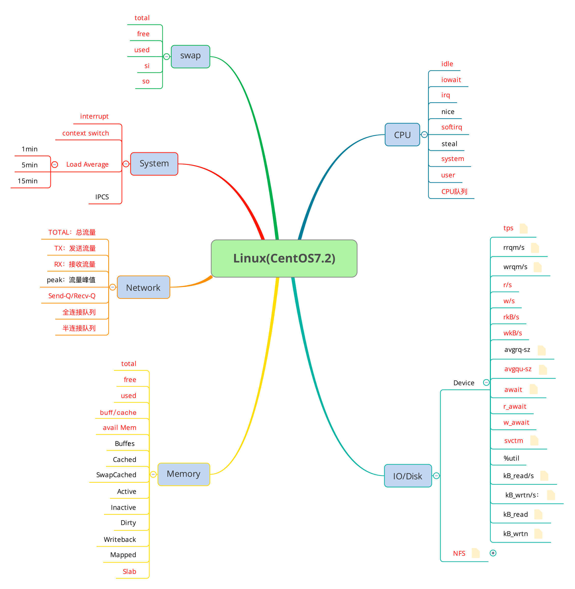

针对OS，我通常看上图中红色计数器的部分，这是OS查看的 **第一层**。有第一层就有第二层，所以才需要定向的监控。后面我们再说定向监控的思路。

### DB层（MySQL为例）

我们再说DB层，以MySQL为例。和上面的理念一样，我们也要看架构图。

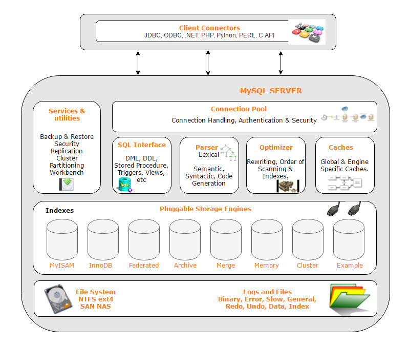

此图来自于MySQL官方，各大技术网站均有展示。

接着我们看下全局监控的分类，如下图所示：

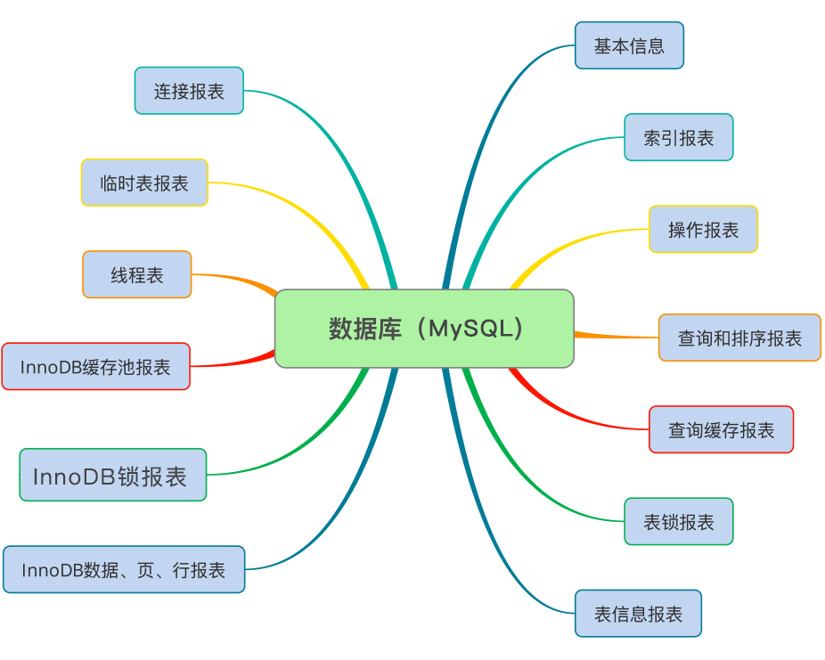

同样，这也是MySQL全局监控的第一层。

这个内容的整理并不具有什么技术性。稍微了解一下Linux和MySQL的架构，就可以整理出来。我们依此类推，按照这个思路，就可以把其他的组件都整理出第一层监控组件。

有了全局监控，接着就是定向监控了。这是寻找 **证据链** 的关键一节。

## 定向监控

有了OS层的全局监控计数器，我们首先要学会的，就是判断这些计数器说明了什么问题。我在第三模块中写监控分析工具，会详细说明这部分。

这里呢，我先把定向监控细化地解释一下，把这个思路给你讲得明明白白，通通透透。

### OS层之定向监控细化1

当你看到CPU消耗得多，那么你就得按照下面这张图细化思路（从左向右看）：


列出流程图来就是如下所示：

```
st=>start: 开始
e=>end: 结束
op1=>operation: 通过si CPU找到对应的软中断号及中断设备
op2=>operation: 再找到软中断对应的模块
op3=>operation: 再到模块对应的实现原理
op4=>operation: 给出解决方案
st->op1->op2->op3->op4->e

```

### OS层之定向监控细化2

当你看到OS全局监控图中的Network中的Total总流量比较大时，就要有这样的分析思路（从右向左看）：

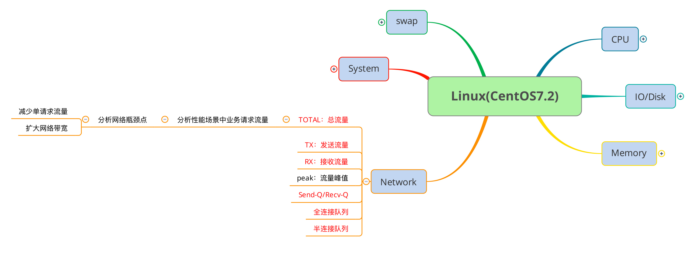

列出流程图来就是如下所示：

```
st=>start: 开始
e=>end: 结束
op1=>operation: 网络总流量
op2=>operation: 分析性能场景中的业务流量
op3=>operation: 分析网络带宽
op4=>operation: 分析网络队列
op5=>operation: 解决方案
st->op1->op2->op3->op4->op5->e

```

依此类推，就可以列出更多OS层的定向监控分析的思路。

### DB层之定向监控细化1

同OS层的定向监控细化思路一样，在DB层中要想找到完整的链路，那么在MySQL中也必须把逻辑想明白。

当你发现查询和排序的报表有问题时，比如说下面这样（数据来自于MySQL Report）：

```
__ SELECT and Sort _____________________________________________________
Scan            7.88M     2.0/s %SELECT:  38.04
Range         237.84k     0.1/s            1.15
Full join       5.97M     1.5/s           28.81
Range check   913.25k     0.2/s            4.41
Full rng join  18.47k     0.0/s            0.09
Sort scan     737.86k     0.2/s
Sort range     56.13k     0.0/s
Sort mrg pass 282.65k     0.1/s

```

居然每秒就能有2次全表扫描！那该怎么办呢？定向细化，如下所示：

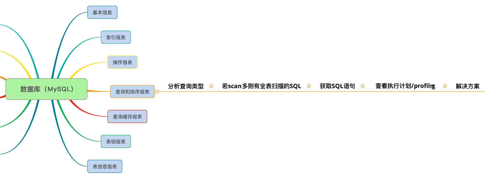

相信这样常规的动作，你肯定能掌握得了。

那么来看下一个。

### DB层之定向监控细化2

当你看到锁数据的时候，如下所示：

```
__ InnoDB Lock _________________________________________________________
Waits          227829     0.1/s
Current             1
Time acquiring
  Total     171855224 ms
  Average         754 ms
  Max            6143 ms

```

当前等待并不多，只有1。但是你看下面的平均时间为754ms，这还能不能愉快地玩耍了？

下面我也同样列出定向监控细化的思路。


分析产生锁的SQL，看SQL的Profiling信息，再根据信息找下一步原因，最终给出解决方案。

有了上面的 **全局—定向** 监控思路，并且将每个组件的第一层的计数器一一列出。这是我们监控分析的第一步。

至于定向监控部分，我不建议一开始就列，主要原因有三个：

1. 耗费太多时间；
2. 列出来也可能半辈子也用不上；
3. 照搬列出来的定向监控逻辑，有可能误导你对实时数据的判断。

所以最好的定向监控就是在实际的性能执行过程中，根据实际的场景画出来。这帮助我在工作中无往不利，理清了很多一开始根本想不到的问题。

## 监控工具

有了思路，工具都不是事儿。

针对上面我们画的架构图，我大概列出相应的监控工具及优缺点。这里列得并不详尽，只供借鉴思路使用。

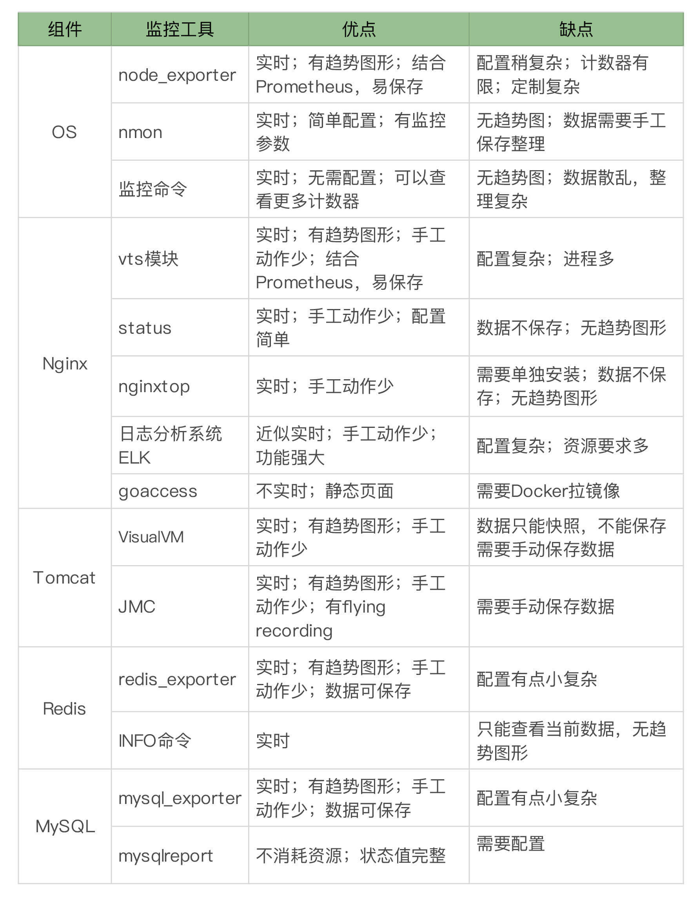

如果要选择的话，肯定是用Prometheus + Exporter的思路会好一点。于是我们这样实现全局的监控。

OS：

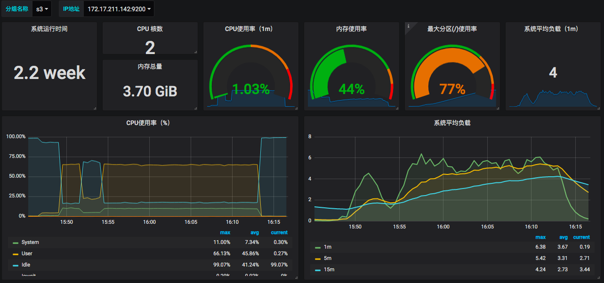

DB：

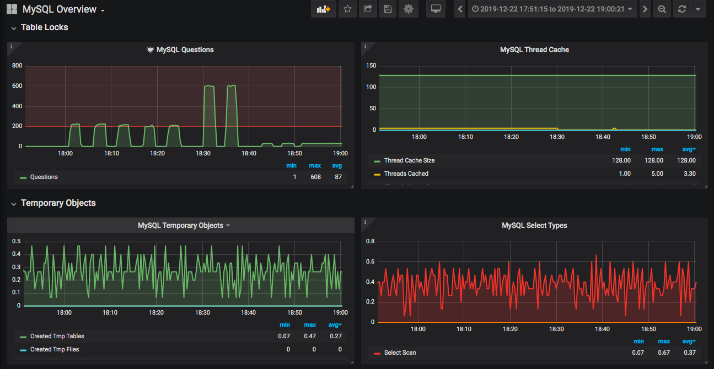

Nginx：

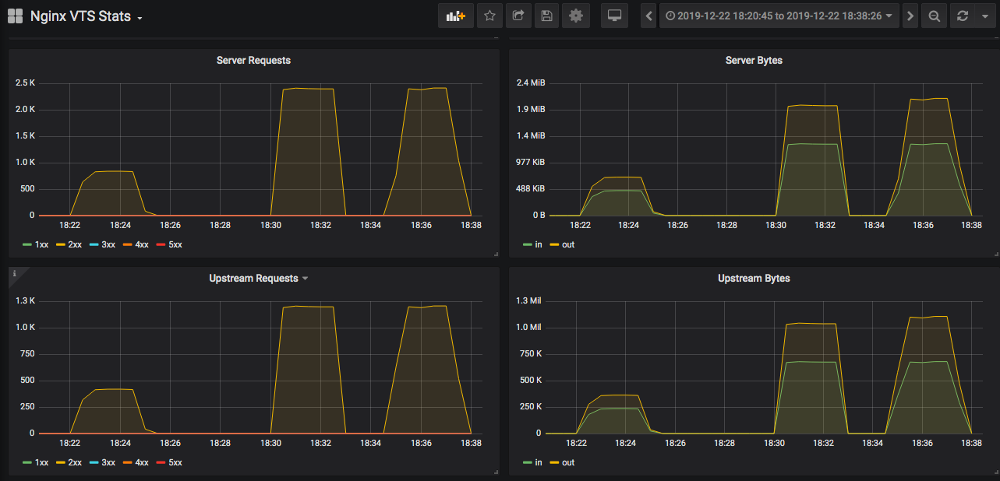

Redis：


上面图看腻了，你能换个吗？客官别着急，现在就换。

Tomcat：

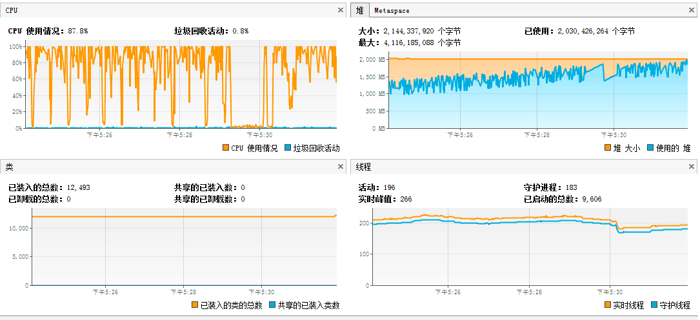

好了，有了这些监控工具，基本上对每个组件的全局监控就解决了。

这时可能会有人说，你这个架构也太不新潮了。现在都玩Kubernetes、Docker、Spring Cloud、微架构啥的了。

那同样，我们还是要列出有哪些监控的组件。

1. Node：就是OS；
2. Cluster；
3. Pod；
4. 微服务链路。

然后再实现相应的全局监控。我们可以在Kubernetes+Docker下可以看到这样的部分全局监控数据。

DashBoard：

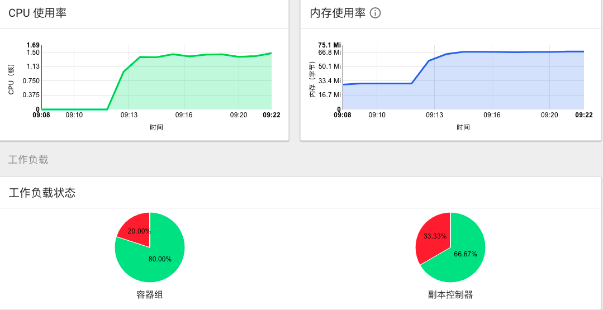

Cluster：


Pod：

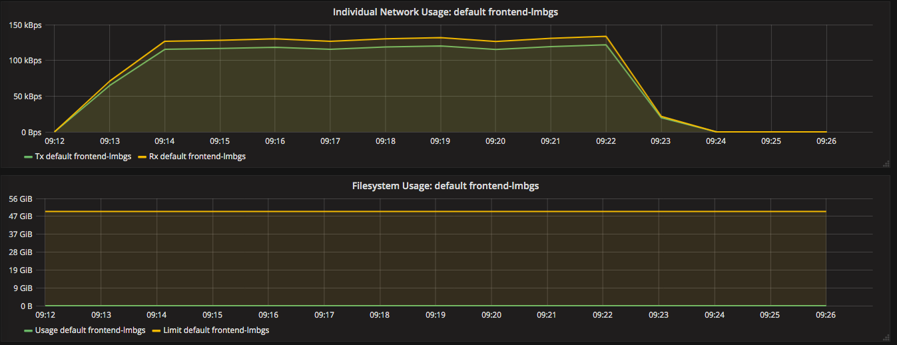

微服务链路：

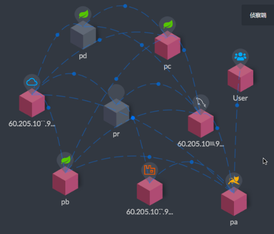

那么具体的定向监控细化呢？在你的具体场景中，照样可以通过上面的思路标识出来。

有人说，那我还有什么什么组件，相信你通看全篇，已经学会思路了，那就自己动手吧。

我想说的是，不管你的架构有多么复杂，组件有多少，这样的监控逻辑都是一定要有的。适合的工具要用，并且尽量多用，但工具还远远替代不了分析的思维逻辑。没有判断的能力，再强悍的工具也只是个花架子。

PS：如没有注明引用，本专栏所有的截图都是在我搭建的环境中截来的，所以不存在在其他地方看到相同图的可能性。

## 总结

在本篇中，我描述了监控设计的思维逻辑。对架构中的组件进行了分析之后，通过 **全局—定向** 的思路列出要看的计数器，再通过相应的监控工具去实现，拿到要分析的数据。

这就完成了要做的监控设计和具体实施。

至于你是用什么工具去实现的，这并不重要，因为拿到监控数据，可供分析证据链最重要。

## 思考题

看完了今天的文章，你不妨说下为什么要先有全局监控，再有定向监控？以及我为什么不建议一开始就上代码级的监控工具呢？

欢迎你在评论区写下你的思考，也欢迎把这篇文章分享给你的朋友或者同事，一起交流一下。