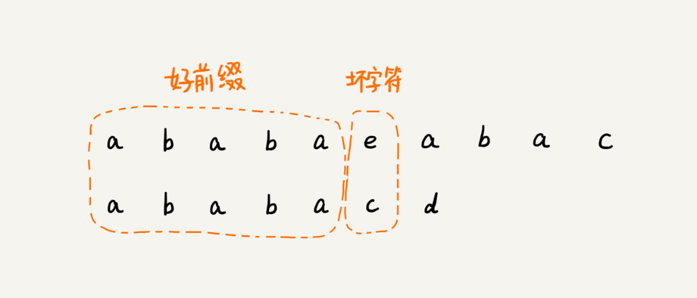
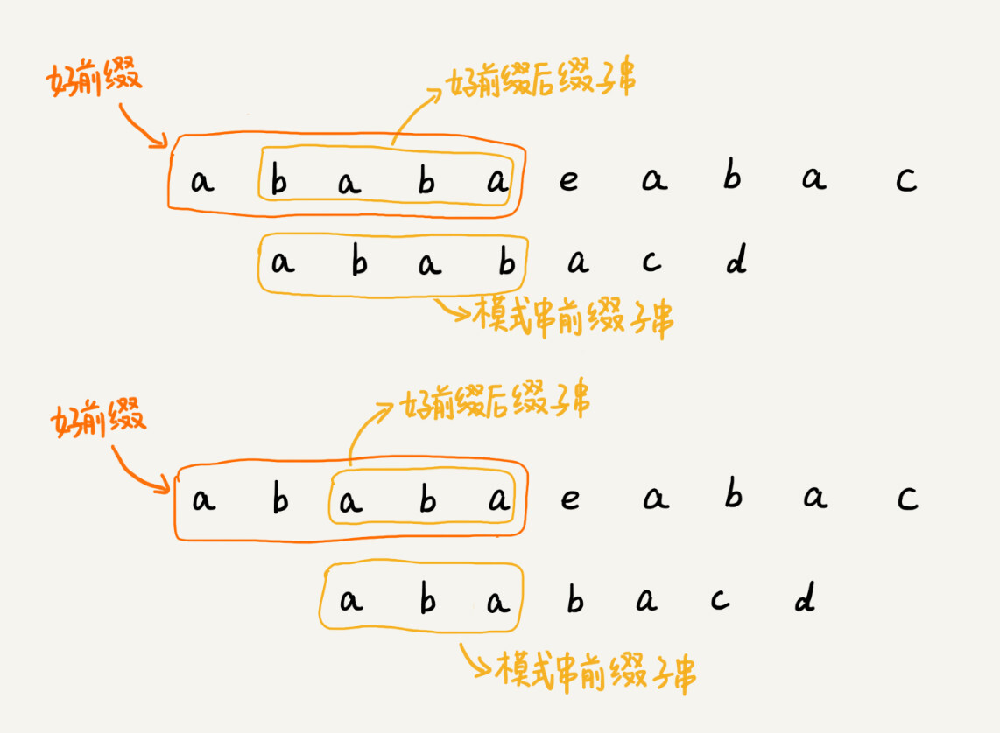
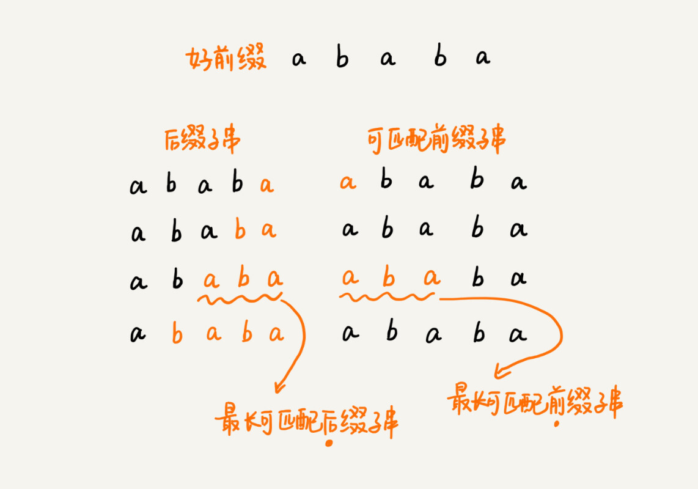
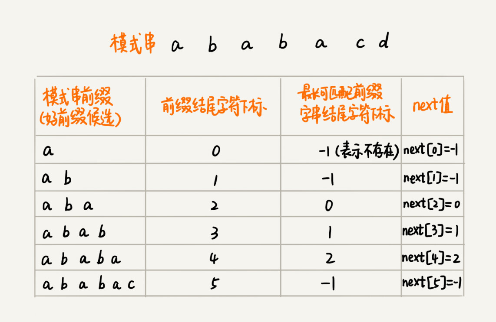
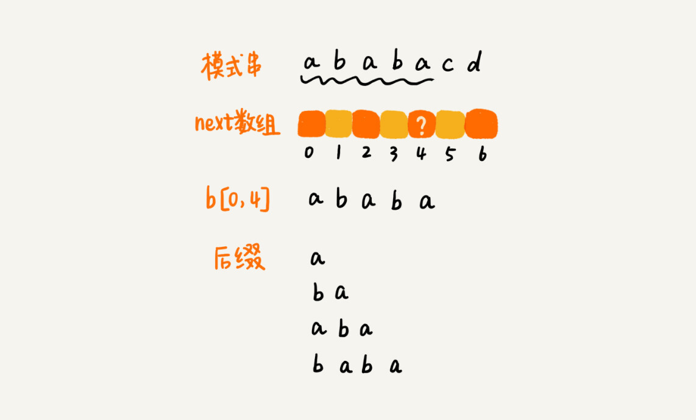

# 34 | 字符串匹配基础（下）：如何借助BM算法轻松理解KMP算法？
上一节我们讲了BM算法，尽管它很复杂，也不好理解，但却是工程中非常常用的一种高效字符串匹配算法。有统计说，它是最高效、最常用的字符串匹配算法。不过，在所有的字符串匹配算法里，要说最知名的一种的话，那就非KMP算法莫属。很多时候，提到字符串匹配，我们首先想到的就是KMP算法。

尽管在实际的开发中，我们几乎不大可能自己亲手实现一个KMP算法。但是，学习这个算法的思想，作为让你开拓眼界、锻炼下逻辑思维，也是极好的，所以我觉得有必要拿出来给你讲一讲。不过，KMP算法是出了名的不好懂。我会尽力把它讲清楚，但是你自己也要多动动脑子。

实际上，KMP算法跟BM算法的本质是一样的。上一节，我们讲了好后缀和坏字符规则，今天，我们就看下，如何借助上一节BM算法的讲解思路，让你能更好地理解KMP算法？

## KMP算法基本原理

KMP算法是根据三位作者（D.E.Knuth，J.H.Morris和V.R.Pratt）的名字来命名的，算法的全称是Knuth Morris Pratt算法，简称为KMP算法。

KMP算法的核心思想，跟上一节讲的BM算法非常相近。我们假设主串是a，模式串是b。在模式串与主串匹配的过程中，当遇到不可匹配的字符的时候，我们希望找到一些规律，可以将模式串往后多滑动几位，跳过那些肯定不会匹配的情况。

还记得我们上一节讲到的好后缀和坏字符吗？这里我们可以类比一下，在模式串和主串匹配的过程中，把不能匹配的那个字符仍然叫作 **坏字符**，把已经匹配的那段字符串叫作 **好前缀**。



当遇到坏字符的时候，我们就要把模式串往后滑动，在滑动的过程中，只要模式串和好前缀有上下重合，前面几个字符的比较，就相当于拿好前缀的后缀子串，跟模式串的前缀子串在比较。这个比较的过程能否更高效了呢？可以不用一个字符一个字符地比较了吗？



KMP算法就是在试图寻找一种规律：在模式串和主串匹配的过程中，当遇到坏字符后，对于已经比对过的好前缀，能否找到一种规律，将模式串一次性滑动很多位？

我们只需要拿好前缀本身，在它的后缀子串中，查找最长的那个可以跟好前缀的前缀子串匹配的。假设最长的可匹配的那部分前缀子串是{v}，长度是k。我们把模式串一次性往后滑动j-k位，相当于，每次遇到坏字符的时候，我们就把j更新为k，i不变，然后继续比较。


为了表述起来方便，我把好前缀的所有后缀子串中，最长的可匹配前缀子串的那个后缀子串，叫作 **最长可匹配后缀子串**；对应的前缀子串，叫作 **最长可匹配前缀子串**。



如何来求好前缀的最长可匹配前缀和后缀子串呢？我发现，这个问题其实不涉及主串，只需要通过模式串本身就能求解。所以，我就在想，能不能事先预处理计算好，在模式串和主串匹配的过程中，直接拿过来就用呢？

类似BM算法中的bc、suffix、prefix数组，KMP算法也可以提前构建一个数组，用来存储模式串中每个前缀（这些前缀都有可能是好前缀）的最长可匹配前缀子串的结尾字符下标。我们把这个数组定义为 **next数组**，很多书中还给这个数组起了一个名字，叫 **失效函数**（failure function）。

数组的下标是每个前缀结尾字符下标，数组的值是这个前缀的最长可以匹配前缀子串的结尾字符下标。这句话有点拗口，我举了一个例子，你一看应该就懂了。



有了next数组，我们很容易就可以实现KMP算法了。我先假设next数组已经计算好了，先给出KMP算法的框架代码。

```
// a, b分别是主串和模式串；n, m分别是主串和模式串的长度。
public static int kmp(char[] a, int n, char[] b, int m) {
  int[] next = getNexts(b, m);
  int j = 0;
  for (int i = 0; i < n; ++i) {
    while (j > 0 && a[i] != b[j]) { // 一直找到a[i]和b[j]
      j = next[j - 1] + 1;
    }
    if (a[i] == b[j]) {
      ++j;
    }
    if (j == m) { // 找到匹配模式串的了
      return i - m + 1;
    }
  }
  return -1;
}

```

## 失效函数计算方法

KMP算法的基本原理讲完了，我们现在来看最复杂的部分，也就是next数组是如何计算出来的？

当然，我们可以用非常笨的方法，比如要计算下面这个模式串b的next\[4\]，我们就把b\[0, 4\]的所有后缀子串，从长到短找出来，依次看看，是否能跟模式串的前缀子串匹配。很显然，这个方法也可以计算得到next数组，但是效率非常低。有没有更加高效的方法呢？



这里的处理非常有技巧，类似于动态规划。不过，动态规划我们在后面才会讲到，所以，我这里换种方法解释，也能让你听懂。

我们按照下标从小到大，依次计算next数组的值。当我们要计算next\[i\]的时候，前面的next\[0\]，next\[1\]，……，next\[i-1\]应该已经计算出来了。利用已经计算出来的next值，我们是否可以快速推导出next\[i\]的值呢？

如果next\[i-1\]=k-1，也就是说，子串b\[0, k-1\]是b\[0, i-1\]的最长可匹配前缀子串。如果子串b\[0, k-1\]的下一个字符b\[k\]，与b\[0, i-1\]的下一个字符b\[i\]匹配，那子串b\[0, k\]就是b\[0, i\]的最长可匹配前缀子串。所以，next\[i\]等于k。但是，如果b\[0, k-1\]的下一字符b\[k\]跟b\[0, i-1\]的下一个字符b\[i\]不相等呢？这个时候就不能简单地通过next\[i-1\]得到next\[i\]了。这个时候该怎么办呢？


我们假设b\[0, i\]的最长可匹配后缀子串是b\[r, i\]。如果我们把最后一个字符去掉，那b\[r, i-1\]肯定是b\[0, i-1\]的可匹配后缀子串，但不一定是最长可匹配后缀子串。所以，既然b\[0, i-1\]最长可匹配后缀子串对应的模式串的前缀子串的下一个字符并不等于b\[i\]，那么我们就可以考察b\[0, i-1\]的次长可匹配后缀子串b\[x, i-1\]对应的可匹配前缀子串b\[0, i-1-x\]的下一个字符b\[i-x\]是否等于b\[i\]。如果等于，那b\[x, i\]就是b\[0, i\]的最长可匹配后缀子串。


可是，如何求得b\[0, i-1\]的次长可匹配后缀子串呢？次长可匹配后缀子串肯定被包含在最长可匹配后缀子串中，而最长可匹配后缀子串又对应最长可匹配前缀子串b\[0, y\]。于是，查找b\[0, i-1\]的次长可匹配后缀子串，这个问题就变成，查找b\[0, y\]的最长匹配后缀子串的问题了。


按照这个思路，我们可以考察完所有的b\[0, i-1\]的可匹配后缀子串b\[y, i-1\]，直到找到一个可匹配的后缀子串，它对应的前缀子串的下一个字符等于b\[i\]，那这个b\[y, i\]就是b\[0, i\]的最长可匹配后缀子串。

前面我已经给出KMP算法的框架代码了，现在我把这部分的代码也写出来了。这两部分代码合在一起，就是整个KMP算法的代码实现。

```
// b表示模式串，m表示模式串的长度
private static int[] getNexts(char[] b, int m) {
  int[] next = new int[m];
  next[0] = -1;
  int k = -1;
  for (int i = 1; i < m; ++i) {
    while (k != -1 && b[k + 1] != b[i]) {
      k = next[k];
    }
    if (b[k + 1] == b[i]) {
      ++k;
    }
    next[i] = k;
  }
  return next;
}

```

## KMP算法复杂度分析

KMP算法的原理和实现我们就讲完了，我们现在来分析一下KMP算法的时间、空间复杂度是多少？

空间复杂度很容易分析，KMP算法只需要一个额外的next数组，数组的大小跟模式串相同。所以空间复杂度是O(m)，m表示模式串的长度。

KMP算法包含两部分，第一部分是构建next数组，第二部分才是借助next数组匹配。所以，关于时间复杂度，我们要分别从这两部分来分析。

我们先来分析第一部分的时间复杂度。

计算next数组的代码中，第一层for循环中i从1到m-1，也就是说，内部的代码被执行了m-1次。for循环内部代码有一个while循环，如果我们能知道每次for循环、while循环平均执行的次数，假设是k，那时间复杂度就是O(k\*m)。但是，while循环执行的次数不怎么好统计，所以我们放弃这种分析方法。

我们可以找一些参照变量，i和k。i从1开始一直增加到m，而k并不是每次for循环都会增加，所以，k累积增加的值肯定小于m。而while循环里k=next\[k\]，实际上是在减小k的值，k累积都没有增加超过m，所以while循环里面k=next\[k\]总的执行次数也不可能超过m。因此，next数组计算的时间复杂度是O(m)。

我们再来分析第二部分的时间复杂度。分析的方法是类似的。

i从0循环增长到n-1，j的增长量不可能超过i，所以肯定小于n。而while循环中的那条语句j=next\[j-1\]+1，不会让j增长的，那有没有可能让j不变呢？也没有可能。因为next\[j-1\]的值肯定小于j-1，所以while循环中的这条语句实际上也是在让j的值减少。而j总共增长的量都不会超过n，那减少的量也不可能超过n，所以while循环中的这条语句总的执行次数也不会超过n，所以这部分的时间复杂度是O(n)。

所以，综合两部分的时间复杂度，KMP算法的时间复杂度就是O(m+n)。

## 解答开篇&内容小结

KMP算法讲完了，不知道你理解了没有？如果没有，建议多看几遍，自己多思考思考。KMP算法和上一节讲的BM算法的本质非常类似，都是根据规律在遇到坏字符的时候，把模式串往后多滑动几位。

BM算法有两个规则，坏字符和好后缀。KMP算法借鉴BM算法的思想，可以总结成好前缀规则。这里面最难懂的就是next数组的计算。如果用最笨的方法来计算，确实不难，但是效率会比较低。所以，我讲了一种类似动态规划的方法，按照下标i从小到大，依次计算next\[i\]，并且next\[i\]的计算通过前面已经计算出来的next\[0\]，next\[1\]，……，next\[i-1\]来推导。

KMP算法的时间复杂度是O(n+m)，不过它的分析过程稍微需要一点技巧，不那么直观，你只要看懂就好了，并不需要掌握，在我们平常的开发中，很少会有这么难分析的代码。

## 课后思考

至此，我们把经典的单模式串匹配算法全部讲完了，它们分别是BF算法、RK算法、BM算法和KMP算法，关于这些算法，你觉得什么地方最难理解呢？

欢迎留言和我分享，也欢迎点击“请朋友读”，把今天的内容分享给你的好友，和他一起讨论、学习。