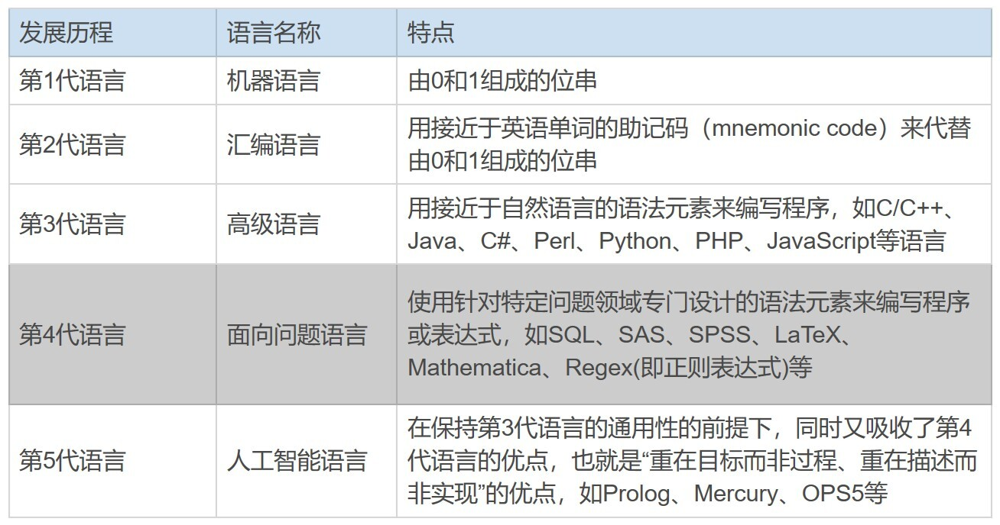
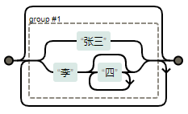

# 加餐 | 从编程语言的角度来理解正则表达式
你好，我是林耀平，你也可以直接叫我的网名笨笨阿林。很高兴能在极客时间和你聊聊我理解的正则表达式。

在我看来，正则表达式是那种典型的，对没用过的人来说，不觉得对自己有什么影响，可是一旦用过了，就再也回不去的神器。当然，我这里所说的“用过”，不是指简单使用一些正则的基本功能，而是指能够熟练运用基本功能和高级功能。所以说，对于正则表达式，你用得越熟练，就会越会惊叹于它的强大与神奇。

对于正则表达式的分析和解读，目前大多数文章和书籍多集中在正则表达式自身，比如对正则表达式的各个元字符、元转义序列以及匹配原理的分析和解读上。这些当然十分重要，是我们学习正则的基础。但这一节作为加餐，我将尝试给你提供一个新的理解角度：在我看来，正则表达式也是一门编程语言。为啥这么说呢？下面我将带你从编程语言发展史的角度，以及编程范式的角度来具体看看。

## 为啥说正则表达式也是一门编程语言？

我们知道，程序代码是对现实事物处理逻辑的抽象，而正则表达式，则是对复杂的字符匹配程序代码的进一步抽象；也就是说，高度简洁的正则表达式，可以认为其背后所对应的，是字符匹配程序代码，而字符匹配程序代码，背后对应的是字符匹配处理逻辑。

因此，我们可以这么认为，字符匹配处理逻辑，可以抽象为字符匹配程序代码；字符匹配程序代码，可以再进一步，抽象为高度简洁的正则表达式。怎么理解呢？我们举个例子来说。


如果我们要在一段文本中同时查找“张三”和“李四”这两个名字，字符匹配处理逻辑就是：当查找到了“张三”，则提示“找到了‘张三’”，当查找到了“李四”，则提示“找到了‘李四’”；如果将这段字符匹配处理，逻辑抽象为字符匹配程序伪代码，就是下面这样：

```
var str = "张三正在学习正则表达式......"
if (find("张三", str) == true) then showMessage("找到了'张三'")
else if (find("李四", str) == true) then showMessage("找到了'李四'")
else showMessage("没有找到")

```

上面的这两行字符匹配程序伪代码，如果进一步抽象为正则表达式，就是：张三\|李四。

你看，相对于字符匹配程序代码，正则表达式不需要使用if、then、else等关键字，也不需要调用find、showMessage等函数，这些在正则表达式中都已经隐含了。也就是说，正则表达式解析引擎，会自动按类似逻辑进行解析，这也就是正则表达式“高度简洁”的体现。

### 从编程语言发展史角度来理解

那说了这么多，我们下面来看看编程语言的发展历程。我把它们大致上分为了5代。你可以看一下下面这个表。



显然，正则表达式也是一种编程语言，而且是属于第4代语言——面向问题语言中的一种。

可以看到，第4代语言相对于第3代语言，更专注于某个特定、专门的业务逻辑和问题领域。程序员主要负责分析问题，以及使用第4代语言来描述问题，而无需花费大量时间，去考虑具体的处理逻辑和算法实现，处理逻辑和算法实现是由编译器（Compiler）或解释器（Interpreter）这样的语言解析引擎来负责的。

事实上，最初之所以提出第4代语言的概念，其目的就是希望非专业程序员也能做应用开发，不过就目前情况来看，这个目的并没有得到很好的实现。

### 从编程范式角度来理解

编程范式（Programming Paradigm），指的是计算机编程中的基本风格和典范模式，是程序员在其所创造的程序虚拟世界中自觉不自觉地所采用的世界观和方法论。

常见的编程范式大致上有：命令式、声明式（包括了函数式、逻辑式等）、面向对象式、泛型式、并发式、切面式等。每种编程范式都引导着程序员，根据其特有的倾向（即世界观）和思路（即方法论）去分析和解决编程问题。

下面我们来重点讲一下命令式和声明式这两种编程范式。

我们先来看第一种， **命令式编程范式。**

命令式编程范式，主要就是模拟电脑运算的过程。更进一步地来说，是直接模拟目前主流的冯·诺依曼机（Von Neumann Machine）的运算过程，是对冯·诺伊曼机运行机制的抽象。

冯·诺伊曼机的基本特点是，在程序计数器的集中控制下，按顺序依次从内存中获取指令和数据，然后进行执行，因此它是以控制驱动的控制流方式工作的。与冯·诺依曼机相对应的还有以数据驱动的数据流方式工作的数据流机，以及以需求驱动的数据流方式工作的归约机等。

采用命令式编程范式的程序，是由若干行动指令所组成的有序指令列表，也就是由一系列指明执行顺序的祈使句——“先做这，再做那”所组成，属于行动导向，强调的是定义问题的解法——即“怎么做”，因而算法是显性的而目标是隐性的。

因此，从编程范式的角度来看：

- 命令式编程的世界观是：程序是由若干行动指令组成的有序列表；
- 命令式编程的方法论是：用变量来存储数据，用语句来执行指令。

如果追根溯源的话，几乎所有基于冯·诺伊曼机的编程语言，其实都可看作汇编语言的升级，而作为与机器语言一一对应的汇编语言来说，它自然是命令式的，因而命令式编程范式最为基础和普及。不过，从纯粹性的角度来说，命令式编程范式的代表语言为Fortran、Pascal、C等。

**第二种是声明式编程范式**。

声明式编程范式，主要是模拟人脑思维的过程。声明式重目标、轻过程，专注问题的分析和表达，而不是算法实现。它不用指明执行顺序，属于目标导向，强调的是定义问题的描述——即“做什么”，因而目标是显性而算法是隐性的。

因此，从编程范式的角度来看：

- 声明式编程的世界观是：程序是由若干目标任务组成的有序列表；
- 声明式编程的方法论是：用语法元素来描述任务，由解析引擎转化为指令并执行。

事实上，前面所说的第4代，面向问题的语言，基本上都属于声明式编程范式，而且往往也只支持声明式编程范式。声明式编程范式的主要特点就是，重在目标而非过程、重在描述而非实现，以声明式语句直接描述要解决的目标任务，专注于任务的分析和表达。声明式没有专注于处理逻辑和算法实现的过程，它具体的处理逻辑和算法实现是由语言解析引擎来负责的。

声明式编程的代表语言为SQL、SAS、SPSS、LaTeX、Regex（即正则表达式）等。

讲到这里你可能会有疑问，既然是程序，那它总是要实现功能的，通过声明式编程语言所编写的程序，到底是如何实现功能的呢？事实上，这是由语言解析引擎，也就是编译器或解释器，最终通过命令式编程来实现功能的。不过，这仅限于冯·诺依曼机中的编程语言，非冯·诺依曼机中的编程语言就不一定是这样了。

换句话说，声明式编程是建立在命令式编程的基础之上的。这也是声明式编程比命令式编程更为高级、更加简单、更省人工的原因。事实上，正如前面所讲过的，目前基于冯·诺依曼机的几乎所有编程语言都是以命令式编程为基础。

**相较于通用编程语言GPPL，正则表达式属于领域特定语言DSL**。

当然，这样一来，这些由语言解析引擎所实现的处理逻辑和具体算法，它们的通用性就会比较差，只能适用于某些特定业务或特定领域。也正是因为这个原因，第4代语言基本都是局限于某些特定领域，大多被认为是领域特定语言DSL（Domain Specific Language），也称为领域专用语言。

与领域特定语言相对应的是通用编程语言GPPL（General-Purpose Programming Language），作为第3代语言的高级语言大都属于通用编程语言，基本上都支持命令式编程范式。

通用编程语言解决问题的处理逻辑和算法实现，可以由程序员灵活设计、自由发挥，然而，正像是前面所说的，由于领域特定语言大都只属于声明式编程范式，解决问题的处理逻辑和算法实现，是由语言解析引擎自动完成的，程序员一般只需要也只能够声明式地描述问题，而不需要也不能够命令式地自行自由设计解决问题的处理逻辑和算法实现，程序员灵活设计、自由发挥的空间很小。

因此，领域特定语言几乎没有通用性，而且也大都是非图灵完备的语言。这里的图灵完备是什么意思呢？一个能计算出每个图灵可计算函数（Turing-computable function）的计算系统，就被称为图灵完备的；一个语言是图灵完备的，就意味着该语言的计算能力与一个通用图灵机（Universal Turing Machine）相当。

这里又提到了两个新概念：图灵可计算函数和通用图灵机。我们只需要记住下面这么一个关键点：当我们说一门编程语言是图灵完备的语言时，说明这门语言所拥有的编程能力，是现代计算机语言所能拥有的最高能力。

而领域特定语言大都不是图灵完备的语言，因此在计算能力、表达能力和功能上，相对于通用编程语言这样的图灵完备的语言来说，要受到很大的限制，只能专用于解决特定业务方向和特定业务领域的专门问题。

比如，SQL是专用于解决数据库操作问题的语言、SAS和SPSS是专用于解决统计分析问题的语言、LaTeX是专用于解决排版问题的语言，Mathematica是专用于解决科学计算问题的语言；而我们这里所讨论的正则表达式（Regex，Regular expression），则是专用于解决文本查找匹配问题的专门语言。

## 正则表达式的语法元素本质上就是程序逻辑和算法

前面说了，正则表达式从编程语言发展史的角度上来看，其实是属于第4代的面向问题语言。正则从编程范式的角度上来看，其实是属于声明式编程范式，并且是专用于处理文本查找匹配这个特定领域的专门语言。理解了这些，我们就比较容易理解之前所提到的，正则表达式是文本查找匹配处理逻辑和文本查找匹配程序代码的抽象这一点了。

实际上，更进一步地来说，正则表达式中的语法元素——元字符、元转义序列与特殊结构，可理解为某种具体的程序逻辑和算法的体现。注意，这里提到的元转义序列，指的是相对于将元字符转义为字符本义的普通转义序列来说的。

比如，正则表达式中的星号量词“ `*`”这一元字符，就是高级语言的处理逻辑“循环结构”的体现。具体来说，星号量词“ `*`”代表的是不定次数循环结构，而前后多个星号量词的嵌套就是多层不定次数循环结构的嵌套；或运算符，也就是竖线“\|”这个元字符，就是高级语言的处理逻辑“分支结构”的体现；而用于分组的圆括号“()”，就相当于高级语言的作用域。

而当或运算符“\|”出现在由星号量词“ `*`”所限定的分组圆括号“()”中时，其实就是在“循环结构”中嵌套了“分支结构”；而如果进一步地，“循环结构”所嵌套的“分支结构”中的某个分支，又被某个星号量词“ `*`”所限定，那么则相当于“循环结构”所嵌套的“分支结构”又嵌套了“循环结构”。

比如下面这个正则表达式：(张三\|李四\*)\*。这里我们就不写匹配程序伪代码了，我们以图示的形式来展示处理逻辑，这样更为直观和形象。



另外，从语法结构的角度来看，正则表达式的基本语法结构与一般高级编程语言差不多，主要就是顺序结构（也称为连接结构）、分支结构（也称为选择结构）、循环结构（也称为重复结构）三种，其他都是这三种基本语法结构的组合，再加上一些语法糖。

这里我们还是以前面提到的“(张三\|李四 `*`) `*`”这个正则表达式为例。“张”和“三”以及“李”和“四”这两组字符内部的结构，都属于顺序结构。“张三”和“李四 `*`”这两者则属于分支结构中的两个分支。而“四\*”和整个正则表达式“(张三\|李四 `*`) `*`”都是循环结构，并且前者嵌套在后者内部之中。

根据上面的分析，从正则表达式作为一个声明式编程范式的领域特定语言DSL的角度来讲，正则表达式的顺序结构、分支结构、循环结构这三种基本语法结构是非常简洁、紧凑的。这几乎是作为声明式编程范式的领域特定语言的基本特点，而正则表达式将这一点体现得尤为淋漓尽致。

其中，由于连接结构最为普遍和常见，因此不通过元字符来表示，而是直接以前后顺序来表示；分支结构通过竖线元字符“\|”这个或运算符来表示；而循环结构则通过量词元字符“ `*`”、“+”或“{n,m}”等来表示。

这三种基本语法结构在使用时，只需要简单直接地进行声明式描述，不需要程序员通过复杂的命令式程序语句来进行匹配逻辑和匹配算法的设计，从而大大简化了文本查找匹配功能的实现。

## 总结

好了，今天的内容讲完了，我来带你总结回顾一下。

今天我为你提供了一个新的角度，那就是除了从正则表达式自身的语法元素、功能特性等角度来理解正则表达式之外，我们还可以站在编程语言以及编程范式的层面去理解正则表达式。

其实啊，正则表达式是一门第4代面向问题的编程语言，使用针对特定问题领域专门设计的语法元素来编写表达式。第4代语言相对于第3代语言，更专注于某个特定、专门的业务逻辑和问题领域。它的各个语法元素本质上就是常见的通用编程语言中的处理逻辑和算法实现的体现，并且同样具有三大基本语法结构，也就是顺序结构、分支结构和循环结构。

## 思考题

最后，还是给你留一个思考题。对于从编程语言的发展和演化角度，以及从编程范式的角度来理解正则表达式，给你带来了什么启发呢？这对于其他编程语言的学习和程序设计，究竟又有什么作用和实际意义呢？

欢迎留言参与讨论。今天的课程就结束了，希望可以帮助到你。如果有收获，也欢迎你把这节课分享给你的朋友或者同事，一起交流一下。