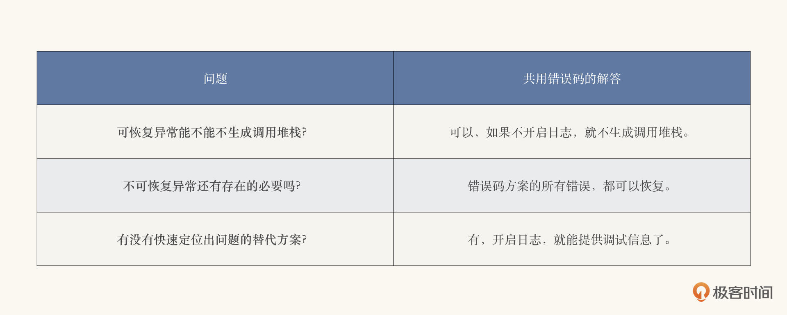

# 09 | 异常恢复，付出的代价能不能少一点？
你好，我是范学雷。今天，我们接着讨论Java的错误处理。这一讲，是上一次我们讨论的关于错误处理问题的继续和升级。

就像我们上一次讨论到的，Java的异常处理是一个对代码性能有着重要影响的因素。所以说，Java错误处理的缺陷和滥用也成为了一个热度始终不减的老话题。但是，Java的异常处理，有着天生的优势，特别是它在错误排查方面的作用，我们很难找到合适的替代方案。

那有没有可能改进Java的异常处理，保持它在错误排查方面的优势的同时，提高它的性能呢？这是一个又让马儿跑，又让马儿不吃草的问题。不过，这并不妨碍我们顺着这个思路，找一找其中的可能性。

我们还是先从阅读案例开始，来试着找一找其中的蛛丝马迹吧。

## 阅读案例

要尝试解决一个问题，我们首先要做的，就是把问题梳理清楚，定义好。我们先来看看Java异常处理的三个典型使用场景。

下面的这段代码里，有三个不同的异常使用方法。在分别解析的过程中，你可能会遇到几个疑问，不过别急，带着这几个问题，我们最后来一一解读。

```java
package co.ivi.jus.stack.former;

import java.security.NoSuchAlgorithmException;

public class UseCase {
    public static void main(String[] args) {
        String[] algorithms = {"SHA-128", "SHA-192"};

        String availableAlgorithm = null;
        for (String algorithm : algorithms) {
            Digest md;
            try {
                md = Digest.of(algorithm);
            } catch (NoSuchAlgorithmException ex) {
                // ignore, continue to use the next algorithm.
                continue;
            }

            try {
                md.digest("Hello, world!".getBytes());
            } catch (Exception ex) {
                System.getLogger("co.ivi.jus.stack.former")
                        .log(System.Logger.Level.WARNING,
                             algorithm + " does not work",
                             ex);
                continue;
            }

            availableAlgorithm = algorithm;
        }

        if (availableAlgorithm != null) {
            System.out.println(availableAlgorithm + " is available");
        } else {
            throw new RuntimeException("No available hash algorithm");
        }
    }
}

```

### 可恢复异常

第一种就是可恢复的异常处理。

这是什么意思呢？对于代码里的异常NoSuchAlgorithmException来说，这段代码尝试捕获、识别这个异常，然后再从异常里恢复过来，继续执行代码。我们把这种可以从异常里恢复过来，继续执行的异常处理叫做可恢复的异常处理，简称为可恢复异常。

为了深入理解可恢复异常，我们需要仔细地看看NoSuchAlgorithmException这个异常的处理过程。这个处理的过程，其实就只有一行有效的代码，也就是catch语句。

```java
} catch (NoSuchAlgorithmException nsae) {
    // ignore, continue to use the next algorithm.
}

```

只要catch语句能够捕获、识别到这个异常，这个异常的生命周期就结束了。catch只需要知道异常的名字，而不需要知道异常的调用堆栈。不使用异常的调用堆栈，也就意味着这样的异常处理，极大地消弱了Java异常在错误排查方面的作用。

**既然可恢复异常不使用异常的调用堆栈，是不是可恢复异常就不需要生成调用堆栈了呢？这是我们提出的第一个问题。**

从Java异常的性能基准测试结果看，我们知道，生成异常的调用堆栈是异常处理影响性能的最主要因素。如果不需要生成调用堆栈，那么Java异常的处理性能就会有成百上千倍的提升。所以，如果我们找到了第一个问题的答案，我们就解决了可恢复异常的性能瓶颈。

### 不可恢复异常

好了，我们再回头看看第二个使用场景。对于代码里的异常RuntimeException来说，上面的代码并没有尝试捕获、识别它。这个异常直接导致了程序的退出，并且把异常的信息和调用堆栈打印了出来。

```java
Exception in thread "main" java.lang.RuntimeException: No available hash algorithm
	at co.ivi.jus.stack.former.UseCase.main(UseCase.java:27)

```

这样的异常处理方式导致了程序的中断，程序不能从异常抛出的地方恢复过来。我们把这种方式，叫做不可恢复的异常处理，简称为不可恢复异常。

调用堆栈对于不可恢复异常来说至关重要，因为我们可以从异常调用堆栈的打印信息里，快速定位到出问题的代码。毫无疑问，这加快了问题排查，降低了运维的成本。

由于不可恢复异常中断了程序的运行，所以它的性能开销是一次性的。因此，不可恢复异常对于性能的影响，其实我们不用太在意。

使用了异常信息和调用堆栈，又不用担心性能的影响，不可恢复异常似乎很理想。可是，在多大的程度上，我们可以允许程序由于异常中断而退出呢？这是一个很难回答的问题。

试想一下，如果是作为服务器的程序，我们会希望它能一直运行，遇到异常能够恢复过来。所以一般情况下，服务器的场景下，不会使用不可恢复异常。

现在的客户端程序呢？比如手机里的app，如果遇到异常就崩溃，我们就不会有耐心继续使用了。似乎，客户端的程序，也没有多少不可恢复异常的使用场景。

也许，不可恢复异常的使用场景，仅仅存在于我们的演示程序里。高质量的产品里，似乎很难允许不可恢复异常的存在。

**既然我们无法忍受程序的崩溃，那么不可恢复异常还有存在的必要吗？这是我们提出的第二个问题。**

### 记录的调试信息

最后，我们再来看看第三个使用场景。对于代码里的异常Exception来说，这段代码尝试捕获、识别这个异常，然后从异常里恢复过来继续执行代码。它是一个可恢复的异常。和第一个场景不同的是，这段代码还在日志里记录了下了这个异常；一般来说，这个异常的调试信息，也就是异常信息和调用堆栈，也会被详细地记载在日志里。

其实，这也是可恢复异常的一个典型的使用场景；程序可以恢复，但是异常信息可以记录待查。

我们再来仔细看看异常信息是怎么记录在案的。为了方便我们观察，我把日志记录的这几行代码单独摘抄了出来。

```java
System.getLogger("co.ivi.jus.stack.former")
        .log(System.Logger.Level.WARNING,
             algorithm + " does not work",
             ex);

```

我们可以看到，日志记录下来了如下的关键信息：

1. 在异常捕获的场景下，这个异常的记录方式，包括是否记录（“co.ivi.jus.stack.former”）；
2. 在异常捕获的场景下，这个异常的记录地点（System.getLogger()）；
3. 在异常捕获的场景下，这个异常的严重程度（Logger.Level）；
4. 在异常捕获的场景下，这个异常表示的影响（“\[algorithm\] does not work”）；
5. 异常生成的时候携带的信息，包括异常信息和调用堆栈（ex）。

其中，前四项信息，是在方法调用的代码里生成的；第五项，是在方法实现的代码里生成的。也就是说，记录在案的调试信息，既包括调用代码的信息，也包括实现代码的信息。

**如果放弃了Java的异常处理机制，我们还能够获得足够的调试信息吗？换种说法，我们有没有快速定位问题的替代方案？这是我们提出的第三个问题。**

## 改进的共用错误码

刚才，我们通过Java异常处理的三个典型场景，提出了三个棘手的问题：

- 既然可恢复异常不使用异常的调用堆栈，是不是可恢复异常就不需要生成调用堆栈了？
- 既然我们无法忍受程序的崩溃，那么不可恢复异常还有存在的必要吗？
- 我们有没有快速定位问题的替代方案？

带着这三个问题，我们再来看看能不能改进一下我们上一讲里讨论的共用错误码的方案。

共用错误码本身，并没有携带调试信息。为了能够快速定位出问题，我们需要为共用错误码的方案补上调试信息。

下面的两段代码，就是我们要在补充调试信息方面做的尝试。第一段代码，是我们在方法实现的代码里的尝试。在这段代码里，我们使用异常的形式补充了调试信息，包括问题描述和调用堆栈。

```java
public static Returned<Digest> of(String algorithm) {
    return switch (algorithm) {
        case "SHA-256" -> new Returned.ReturnValue(new SHA256());
        case "SHA-512" -> new Returned.ReturnValue(new SHA512());
        case null -> {
            System.getLogger("co.ivi.jus.stack.union")
                    .log(System.Logger.Level.WARNING,
                        "No algorithm is specified",
                        new Throwable("the calling stack"));
            yield new Returned.ErrorCode(-1);
        }
        default -> {
            System.getLogger("co.ivi.jus.stack.union")
                    .log(System.Logger.Level.INFO,
                    "Unknown algorithm is specified " + algorithm,
                            new Throwable("the calling stack"));
            yield new Returned.ErrorCode(-1);
        }
    };
}

```

第二段代码，是我们在方法调用的代码里的尝试。在这段代码里，我们补充了调用场景的信息。

```java
Returned<Digest> rt = Digest.of("SHA-128");
switch (rt) {
    case Returned.ReturnValue rv -> {
            Digest d = (Digest) rv.returnValue();
            d.digest("Hello, world!".getBytes());
        }
    case Returned.ErrorCode ec ->
        System.getLogger("co.ivi.jus.stack.union")
                .log(System.Logger.Level.INFO,
                        "Failed to get instance of SHA-128");
}

```

经过这样的调整，类似于使用异常处理的、快速定位出问题的调试信息就又回来了。

```java
Nov 05, 2021 10:08:23 PM co.ivi.jus.stack.union.Digest of
INFO: Unknown algorithm is specified SHA-128
java.lang.Throwable: the calling stack
	at co.ivi.jus.stack.union.Digest.of(Digest.java:37)
	at co.ivi.jus.stack.union.UseCase.main(UseCase.java:10)

Nov 05, 2021 10:08:23 PM co.ivi.jus.stack.union.UseCase main
INFO: Failed to get instance of SHA-128

```

你一定会有这样的问题。调试信息又回来了，难道不是以性能损失为代价的吗？

是的，使用调试信息带来的性能损失，并不比使用异常性能的损失小多少。不过好在，日志记录既可以开启，又可以关闭。如果我们关闭了日志，就不用再生成调试信息了，当然它的性能影响也就消失了。当需要我们定位问题的时候，再启动日志。这时候，我们就能够把性能的影响控制到一个极小的范围内了。

那么，使用错误码的错误处理方案，是怎么处理我们在阅读案例提到的问题的呢？

其实，每一个问题的处理，都很清晰。我把问题和答案都列在了下面的表格里，你可以看一看。



当然，日志并不是唯一可以记录调试信息的方式。比如说，我们还可以使用更便捷的JFR（Java Flight Recorder）特性。

其实，错误码的调试信息使用方式，更符合调试的目的：只有需要调试的时候，才会生成调试信息。那么， **如果继续沿用Java的异常处理机制，调试信息能不能按需开启、关闭呢？这是我们今天的第四个问题，也是提给Java语言设计师的问题。**

有了今天这四个问题做铺垫，如果有一天， Java语言的异常能够支持可以开合的异常处理机制了，想必到时候你就不会感到惊讶了。

## 总结

好，到这里，我来做个小结。刚才，我们了解和讨论了Java异常处理的两个概念：可恢复异常和不可恢复异常。我还给出了在使用错误码的场景下，快速定位问题的替代方案。

这一讲我们并没有讨论新特性，而是我们重点讨论了现在Java异常处理机制的几个热门话题。这节课的重点，是要开拓我们的思维。了解这些热门的话题，不仅可以增加你的谈资，还可以切实地提高你的代码性能和可维护性。

另外，我还拎出了几个今天讨论过的技术要点，这些都可能在你的面试中出现哦。通过这一次学习，你应该能够：

- 了解可恢复异常和不可恢复异常这两个概念，以及它们的使用场景；
  - 面试问题：你的代码是怎么处理Java异常的？
- 了解怎么在使用错误码的方案里，添加快速定位出问题的调试信息；
  - 面试问题：你的代码，是怎么定位可能存在的问题的？

对Java错误处理机制的改进，这会是一个持续热门的话题。而能够了解替代方案，并且使用替代方案的软件工程师，现在还不多。如果你能够展示错误处理的替代方案，而且还不牺牲异常处理的优势，这是一个能够在面试里获得主动权，控制话语权的必杀技。

## 思考题

怎么通过改进Java的异常处理，来获取性能的提升，我们已经花了两讲的时间了。我们提出的这些改进方案，其实依然有很大的提升空间。比如说吧，我们使用了整数表示错误码，这里其实就存在很多问题。

因为有时候，我们可能需要区别不同的错误，这样我们就不能总是使用一个错误码（-1）。如果存在多个错误码，我们怎么知道方法实现的代码返回的错误码是什么呢？编译器能不能帮助我们检查错误码的使用是不是匹配？ 比如说错误码的检查有没有遗漏，有没有多余？如果返回的错误码从两个增加到三个，使用该方法的代码能不能自动地检测到？

解决好这些问题，能够大幅度提高代码的可维护性和健壮性。该怎么解决掉这些问题呢？这是我们今天的思考题。

为了方便你阅读，我把需要两个错误码的案例代码放在了下面。一段代码是方法实现的代码，一段代码是方法使用的代码。你可以在这两段代码的基础上改动，看看最后你是怎么处理多个错误码的。

这一段是方法实现的代码。

```java
public static Returned<Digest> of(String algorithm) {
    return switch (algorithm) {
        case "SHA-256" -> new Returned.ReturnValue(new SHA256());
        case "SHA-512" -> new Returned.ReturnValue(new SHA512());
        case null -> {
            System.getLogger("co.ivi.jus.stack.union")
                    .log(System.Logger.Level.WARNING,
                        "No algorithm is specified",
                        new Throwable("the calling stack"));
            yield new Returned.ErrorCode(-1);
        }
        default -> {
            System.getLogger("co.ivi.jus.stack.union")
                    .log(System.Logger.Level.INFO,
                    "Unknown algorithm is specified " + algorithm,
                            new Throwable("the calling stack"));
            yield new Returned.ErrorCode(-2);
        }
    };
}

```

这一段是方法使用的代码。

```java
Returned<Digest> rt = Digest.of("SHA-128");
switch (rt) {
    case Returned.ReturnValue rv -> {
            Digest d = (Digest) rv.returnValue();
            d.digest("Hello, world!".getBytes());
        }
    case Returned.ErrorCode ec -> {
        if (ec.errorCode() == -1) {
            System.getLogger("co.ivi.jus.stack.union")
                    .log(System.Logger.Level.INFO,
                            "Unlikedly to happen");
        } else {
            System.getLogger("co.ivi.jus.stack.union")
                    .log(System.Logger.Level.INFO,
                            "SHA-218 is not supported");
        }
    }
}

```

欢迎你在留言区留言、讨论，分享你的阅读体验以及验证的代码和结果。我们下节课再见！

注：本文使用的完整的代码可以从 [GitHub](https://github.com/XueleiFan/java-up/tree/main/src/main/java/co/ivi/jus/stack) 下载，你可以通过修改 [GitHub](https://github.com/XueleiFan/java-up/tree/main/src/main/java/co/ivi/jus/stack) 上 [review template](https://github.com/XueleiFan/java-up/tree/main/src/main/java/co/ivi/jus/stack/review/xuelei) 代码，完成这次的思考题。如果你想要分享你的修改或者想听听评审的意见，请提交一个 GitHub的拉取请求（Pull Request），并把拉取请求的地址贴到留言里。这一小节的拉取请求代码，请在 [异常恢复专用的代码评审目录](https://github.com/XueleiFan/java-up/tree/main/src/main/java/co/ivi/jus/stack/review) 下，建一个以你的名字命名的子目录，代码放到你专有的子目录里。比如，我的代码，就放在stack/review/xuelei的目录下面。