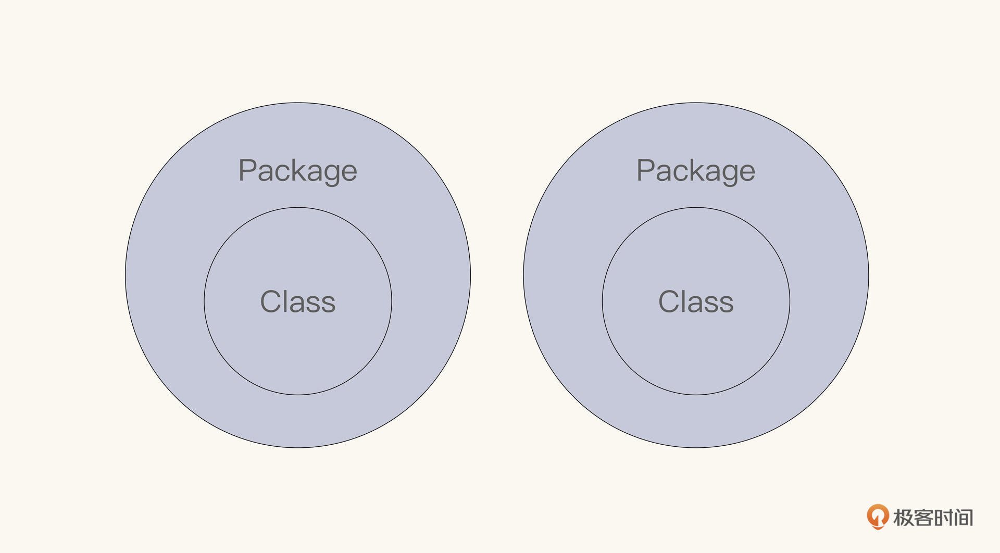
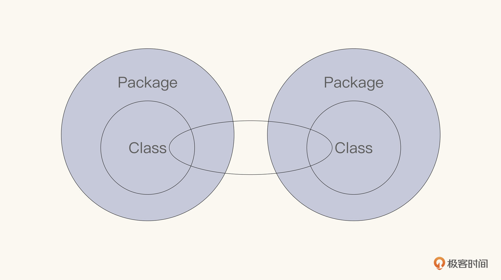
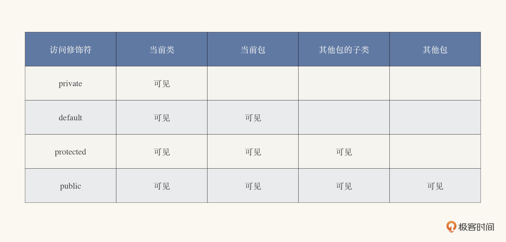

# 17 | 模块系统：为什么Java需要模块化？
你好，我是范学雷。今天，我们一起来讨论Java平台模块系统（Java Platform Module System，JPMS）。

Java平台模块系统是在JDK 9正式发布的。为了沟通起来方便，我们有时候就直接简称为Java模块。Java平台模块系统，可以说是自Java诞生以来最重要的新软件工程技术了。模块化可以帮助各级开发人员在构建、维护和演进软件系统时提高工作效率。软件系统规模越大，我们越需要这样的工程技术。

实现Java平台的模块化是具有挑战性的，Java模块系统（Module System）的最初设想可以追溯到2005年的Java 7，但是最后的发布，是在2017年的 JDK 9。它的设计和实现，花了十多年时间，我们可以想象它的复杂性。

令人满意的是，Java平台模块系统最终呈现的结果是简单、直观的。我们并不需要太长的时间，就能快速掌握这一技术。

我们先来了解Java模块化背后的动力，和它能够带来的工程效率提升。除非特别说明，这一次的讨论，说的都是JDK 8及以前的版本的事情。下一次，我们再来讨论JDK 9之后，我们应该怎么使用Java平台模块系统。

## 缺失的访问控制

我们都清楚并且能够熟练地使用Java的访问修饰符。这样的访问修饰符一共有三个：public、protected，以及private。如果什么修饰符都不使用，那就是缺省的访问修饰符，这也算是一种访问控制。所以，Java语言一共定义了四种类型的访问控制。



private访问修饰符修饰的对象，在同一个类里是可见的；缺省访问修饰符修饰的对象，在同一个Java包里是可见的；pubic访问修饰符修饰的对象，在不同的Java包里也是可见的。有了private、public和缺省的访问修饰符，看起来我们已经能解决大部分的问题了。不过这里还欠缺了重要的一环。

当我们设计对象的扩展能力的时候，我们可能期待扩展的子类处于不同的Java包里。但是，其中的一些数据信息，子类需要访问，但又因为它们是接口实现的细节，不应该对外公开。所以这时候，就需要一个能够穿越Java包，传递到子类的访问修饰符。这个访问修饰符就是protected。protected访问修饰符，在Java包之间打通了一条继承类之间的私密通道。



我们可以用下面这张表来总结Java语言访问修饰符的控制区域。



从这个列表看，Java语言访问修饰符似乎覆盖了所有的可能性，这好像是一个完备的定义。遗憾的是，Java语言访问修饰符遗漏了很重要的一种情况，那就是Java包之间的关系。Java包之间的关系，并不是要么全开放，要么全封闭这么简单。

类似于继承类之间的私密通道，Java包之间也有这种类似私密通道的需求。比如说，我们在JDK的标准类库里，可以看到像java.net这样的放置公开接口的包，也可以看到像sun.net这样的放置实现代码的包。

公开接口，当然需要定义能够广泛使用的类，比如public修饰的Socket类。

```plain
package java.net;

public class Socket implements java.io.Closeable {
    // snipped
}

```

让人遗憾的是，放置公开接口实现代码的包里，也需要定义public的类。这就让本来只应该由某个公开接口独立使用的代码变得所有人都可以使用了。

比如说，用来实现公开接口Socket类的PlatformSocketImpl类，就是一个使用public修饰的类。

```plain
package sun.net;

public interface PlatformSocketImpl {
    // snipped
}

```

虽然PlatformSocketImpl是一个public修饰的类，但是我们并不期望所有的开发者都能够使用它。这是一个用来支持公开接口Socket实现的类。除了实现公开接口Socket的代码之外，它不应该被任何其他的代码和开发者调用。

然而，PlatformSocketImpl是一个public修饰的类。这也就意味着任何代码和开发者都可以使用它。这显然是不符合设计者的预期的。

在JDK 8及以前的版本里，一个对象在两个包之间的访问控制，要么是全封闭的，要么是全开放的。所以，JDK 9之前的Java世界里，它的设计者没有办法强制性地设定PlatformSocketImpl，给出一个恰当的访问控制范围。

两个包之间，没有一个定向的私密通道。换句话说，JDK 9之前的Java语言没有描述和定义包之间的依赖关系，也没有描述和定义基于 **包的依赖关系** 的访问控制规则。 这是一个缺失的访问控制。

这种缺失的关系，带来了严重的后果。

## 松散的使用合约

按照JDK的期望，一个开发者应该只使用公开接口（比如上面提到的Socket类），而不能使用实现细节的内部接口（比如上面提到的PlatformSocketImpl接口）。无论是公开接口，还是内部接口，都可以使用public修饰符。那么，该怎么判断一个接口是公开接口，还是内部接口呢？

解决的办法，是依靠Java接口的使用规范这样的纪律性合约，而不是依靠编译器强制性的检查。 **在JDK里，以java或者javax命名开头的Java包，是公开的接口；其他的包是内部的接口。按照Java接口的使用规范，一个开发者应该只使用公开的接口，而不能使用内部的接口。** 不过，这是一个完全依靠自觉的纪律性约束；Java的编译器和解释器，并不会禁止开发者使用内部接口。

内部接口的维护者可能会随时修改甚至删除内部的接口。使用内部接口的代码，它的兼容性是不受保护的。这是一个危险的依赖，应该被禁止。

遗憾的是，这种纪律性合约是松散的，它很难禁止开发者使用内部接口。我们能够看到大量的、没有遵守内部接口使用合约的应用程序。内部接口的不合规使用，也成了Java版本升级的重要障碍之一。松散的纪律性合约既伤害了内部接口的设计者，也伤害了它的使用者和最终用户。

我们前面提到过，Java平台模块化的设计和实现，花了十多年时间。而内部接口的不合规使用，就是这项工作复杂性的主要来源。

我们认为， **如果一件事情应该禁止，那么最好的办法就是让这件事情没有办法发生；而不是警告发生以后的的后果，或者依靠事后的惩罚。**

那怎么能够更有效的限制内部接口的使用，提高Java语言的可维护能力呢？这是Java语言要解决的一个重要问题。

## 手工的依赖管理

Java语言没有描述和定义包之间的依赖关系，这就直接增加了应用程序部署的复杂性。

公开接口的定义和实现，并不一定是放置在同一个Java包。比如上面我们提到的Socket类和PlatformSocketImpl类就位于不同的Java包。

因为通常情况下，我们使用Jar文件来分发和部署Java应用，所以，公开接口的定义和实现，也不一定是放置在同一个Jar文件里。比如一个加密算法的实现，它的公开接口一般是由JDK定义的；但是它的实现，可能是由一个第三方的类库完成的。


Java的编译器只需要知道公开接口的规范，并不会去检查实现的代码，也不会去链接实现的代码。可是，Java在运行时，不仅需要知道公开接口的字节码，还需要知道实现的字节码。这就导致了编译和运行的脱节。一个能通过编译的代码，运行时可能也会遇到找不到实现代码的错误。

而且，Java的编译器不会在字节码里添加类和包的依赖关系。我们在编译期设置的依赖类库，在运行期还需要重新设置。编译器环节和运行环节是由两个独立的Java命令执行的，所以这种依赖关系也不会从编译期传导到运行期。

由于依赖关系的缺失，Java运行的时候，可能不会完全按照它的设计者的意图工作。这就给Java应用的部署带来很多问题。这一类的问题如此让人讨厌，以至于它还有一个让人亲切不起来的外号，Jar地狱。

为了解决依赖关系的缺失带来的种种问题，业界现在也有了一些解决方案，比如使用Maven和Gradle来管理项目。然而，由于Java没有内在的依赖关系规范，现有的解决方案也就只能依赖人工。依赖人工的手段，也就意味着效率和质量上的潜在风险。

## 缓慢的实现加载

Java语言没有描述和定义包之间的依赖关系，还直接影响了Java应用程序的启动效率。

我们都知道像Spring这样的框架，它缓慢的启动一直都是一个大问题。影响Java应用启动速度的最主要原因，就是类的加载。导致类加载缓慢的一个重要原因，就是很难查找到要加载的类的实现代码。

假设我们设置的class path里有很多Jar文件，对于一个给定名称的class，Java怎么才能找到实现这个类的字节码呢？由于Jar文件里没有描述类的依赖关系的内容，Java的类加载器只能线性地搜索class path下的Jar文件，直到发现了给定的类和方法。这种线性搜索方法当然不是高效的。class path下的Jar文件越多，类加载得就越慢。

更糟糕的是，这种线性搜索的方式，还带来了不可预测的副作用。其中，影子类（Shadowing classes）和版本冲突是最常见的两个副作用。

因为在不同的Jar文件里，可能会存在两个有着相同命名，但是行为不同的类。给定了类的名称，哪一个Jar文件里的类会被首先加载呢？这依赖于Jar文件被检索的顺序。在不同的运行空间，class path的设置可能是不同的，Jar文件被检索的顺序可能也是不同的；所以，实际加载的类就有可能是不同的，最终的运行结果当然也是不同的。这样的问题，可能会导致难以预料的结果，而且非常难以排查。

如果一个类的不同版本的实现都出现在了 class path 里，也会出现类似的问题。

## 新的思路

我们可以看到，这些问题的根源，都来自于Java语言没有描述和定义包之间的依赖关系。那么，我们能不能通过扩展访问修饰符来解决这些问题呢？

答案可能没有这么简单。多个节点之间的依赖关系描述，需要使用的是数学逻辑图。而单个的修饰符，不足以表达复杂的图的逻辑。

另外，Jar文件虽然是Java语言的一种必不可少的代码组织方式，但是它却不是由我们编写的代码直接控制的。我们编写的代码，可以控制Java包，可以控制Java类，但是管不了Jar文件的内容和形式。

所以，要解决这些问题，需要新的思路。而JDK 9发布的Java平台模块系统，就是解决这些问题的一个尝试。

## 总结

好，到这里，我来做个小结。前面，我们讨论了JDK 8及其以前版本的访问控制缺陷，以及由此带来的种种问题。

总体来说，Java语言没有描述和定义包之间的依赖关系。这个缺失，导致了无法有效地封闭实现的细节；无法有效地管理应用的部署；无法精准地控制类的检索和加载，也影响了应用启动的效率。

那能不能在Java语言里添加进来这个缺失的关系呢？该怎么做？这是我们下一次要讨论的话题。

如果面试的时候，讨论到了Java的访问修饰符，你不妨聊一聊这个缺失的环节，以及Jar地狱这样的问题。我相信，这是一个有意思、有深度的话题。

## 思考题

在前面的讨论中，我们提到了使用Maven或者Gradle来管理项目，以此解决依赖关系的缺失。但是，我们并没有展开讨论这些问题是怎么解决的。

如果熟悉Maven、Gradle或者类似的工具的话，你能不能聊一聊，这样的工具，是怎么解决依赖关系缺失这样的问题的？它们哪些地方做得比较好，哪些地方还有待改进？这样的讨论，也许有助于我们深入了解我们这一次讨论到的问题。

欢迎你在留言区留言、讨论，分享你的阅读体验以及你对Maven或者Gradle的了解。我们下节课见！